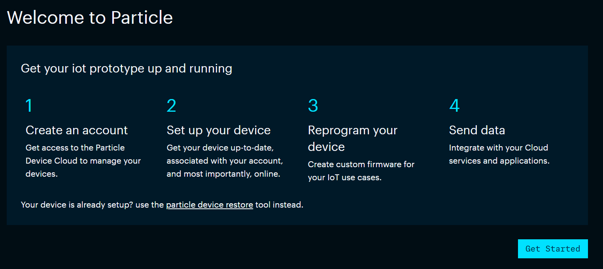
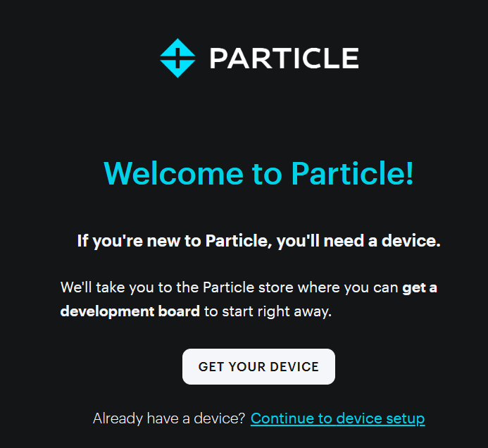
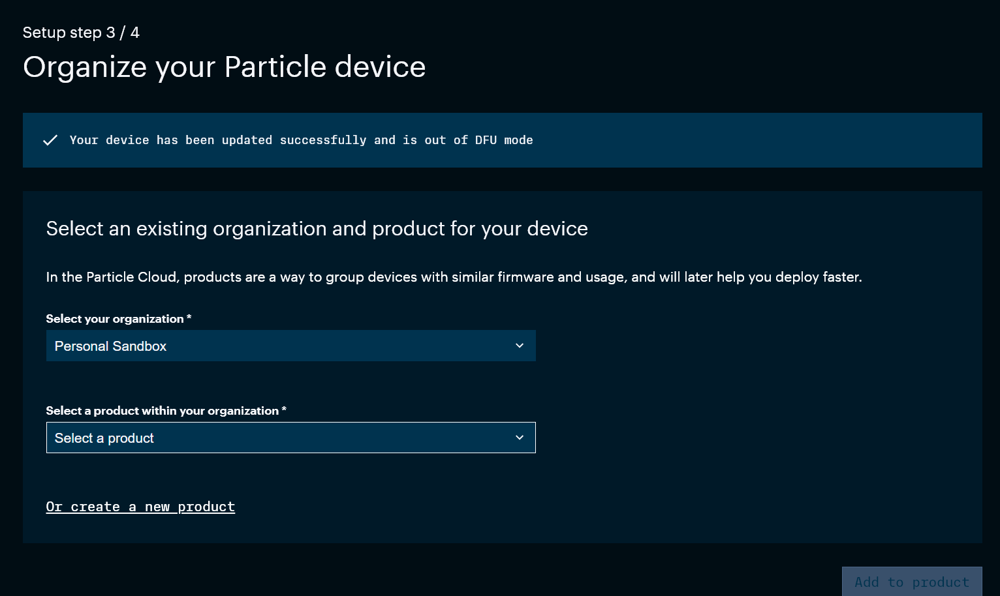

Assignment 0 – Installation and Setup
=====================================

*Nothing to submit*

**Requirements**

-   Connect Photon 2 to Computer
-   Create Particle account
-   Install Particle Workbench
-   Install Fritzing
-   Add Photon 2 device to your Particle account

**IMPORTANT - Browser**

**You need to use the [Chrome](https://www.google.com/chrome/) browser to configure your Photon 2; you <u>can not</u> use Firefox or Safari.** 

\_______________________________________\_

## Connect your Particle Photon 2 to your Computer

- Connect the antenna (discussed in class)
- Connect the Photon 2 to your breadboard (discussed in class)
- Connect the micro USB cable to your computer

Create Particle account
-----------------------

>   In this course, we will use an internet-enabled microcontroller,
>   specifically the Particle Photon 2. In order to communicate with the Photon 2 
>   (e.g. to install new firmware code), we will use Particle’s cloud software.

-   You need to use the [Chrome](https://www.google.com/chrome/) browser to configure your Photon 2 and visit this site:
    [https://setup.particle.io](https://setup.particle.io)

-   Go to **Get Started** and create a new account for education

Setup Your Device
-----------------------

>   Continue with setup in your web browser

* Click **Continue to device setup**

  

- Go to **Get Started**
  

- Choose **Device with USB Port**

- Continue with the four step process to configure your device via USB. This process will take few minutes. As the Photon 2 updates, it will blink different colors.

- When you get to the following screen that says **Organize your Particle Device**, choose **or Create a New Product**
  

- For product name, type **TAC_348** and click **Create new product**
  

- For device name, you can use the default name, or create something unique, just make sure the name has only letters, numbers, and underscore (no spaces or special symbols)
  

  

- Choose your Wifi network.  If you are on campus, use **USC Guest Wireless**, and **leave the password blank**. If it doesn't connect to Wifi on the first try, it often works if you try it again.

  - If you are off-campus and need to login to a website before you can connect to Wifi, you will need to do a couple things before you can get the Photon 2 online. You can follow these [instructions](https://reparke.github.io/TAC348-Making-Smart-Devices/reference/general/captive_wifi.html) or reach out to course staff for assistance. 

- When you see this success page, you can close your browser
  

Install Particle Workbench
--------------------------

>   Workbench is the IDE we will use to write firmware code as well as to
>   install it on the device

-   Open Chrome and visit the site:
    <https://www.particle.io/workbench/>

-   Download and install Particle Workbench

Install Fritzing
----------------

>   Fritzing is a program to create visual layouts of device projects.

-   TAC has paid for a Fritzing support license for the class. To download it, please go to the course Brightspace site and click on "Fritzing Download".

-   Download and install Fritzing, and then continue these instructions

Install Fritzing Library for Additional Parts
----------------

>   There are additional we will used in class that we need Fritzing parts for.

- Download the library for Fritzing:

  [https://github.com/reparke/Fritzing_Collection/archive/main.zip](https://github.com/reparke/Fritzing_Collection/archive/main.zip)

- Unzip the file (take note of the folder location)

- Open Fritzing

- On **Parts** panel on the right side of the screen, click the small dropdown menu and choose **Import…**

- Navigate to the folder with the file you downloaded and open `TAC_348_Parts.fzpz`

- Click the small dropdown menu on the **Parts** panel again and chose *Save Bin*

Deliverables
------------

- There is nothing to submit for this assignment.
