# ITP 348: Car Chassis Setup

 [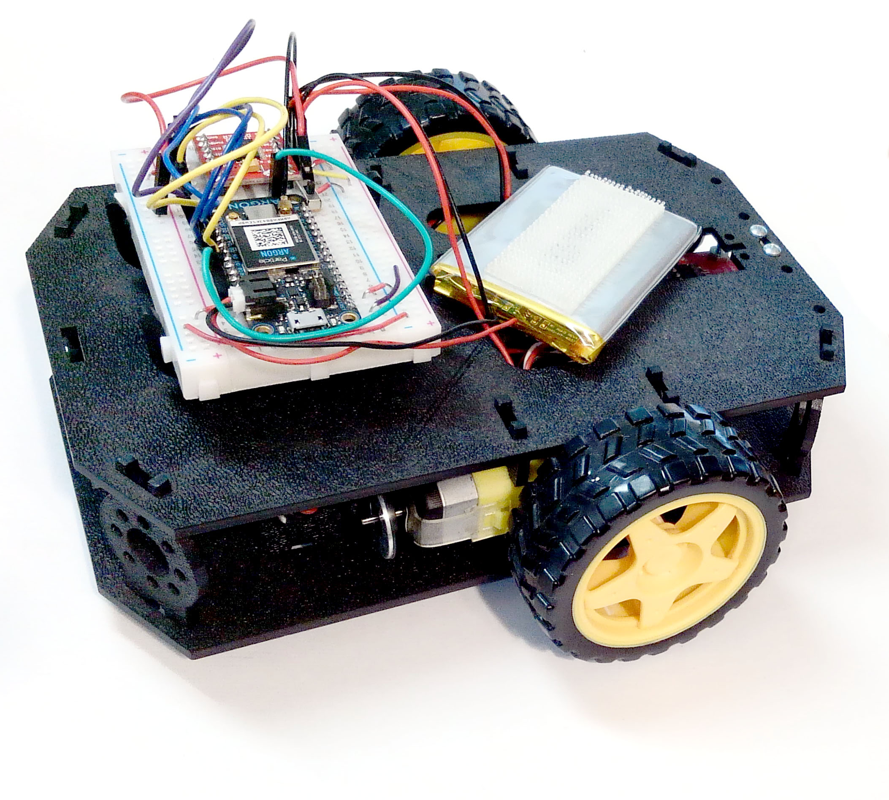](https://cdn.sparkfun.com/assets/learn_tutorials/3/3/7/Redbot_Kit_Brian_Revisions-03.jpg) 

## Items You Will Need

 [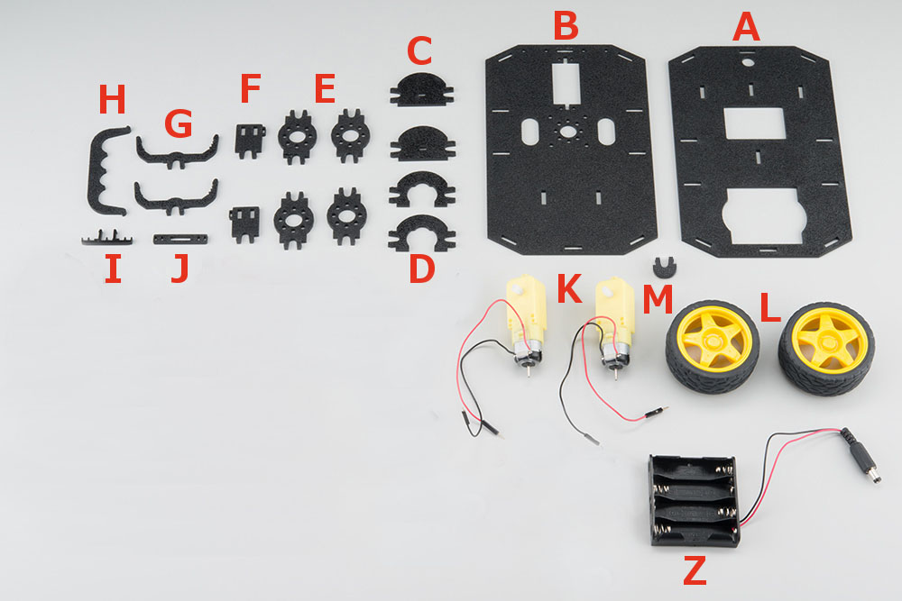](https://cdn.sparkfun.com/assets/learn_tutorials/3/3/7/Redbot_Kit-00_annotated_updated.jpg) 

|      | Part                                             | Qty  |
| ---- | ------------------------------------------------ | ---- |
| A    | Bottom Chassis Plate                             | 1    |
| B    | Top Chassis Plate                                | 1    |
| C    | Front Motor Mount                                | 2    |
| D    | Rear Motor Mount                                 | 2    |
| E    | Side Strut                                       | 4    |
| F    | Encoder Mount (not used)                         | 2    |
| G    | Breadboard Mount                                 | 2    |
| H    | Battery Pack Clip                                | 1    |
| I    | Line Follower Mount (not used)                   | 1    |
| J    | Line Follower Mount Plate (not used)             | 1    |
| K    | [Motor](https://www.sparkfun.com/products/13302) | 2    |
| L    | [Wheel](https://www.sparkfun.com/products/13259) | 2    |
| M    | Nub Caster                                       | 1    |
| O    | Lithium-Ion Battery                              | 1    |
| P    | Breadboard (not shown)                           | 1    |
| Q    | Argon (not shown)                                | 1    |
| Z    | Battery Holder (not used)                        | 1    |

### WARNING: 

- Do **not** attempt to remove chassis parts by squeezing them with pliers because they break easily. Instead gently remove them by hand.

 [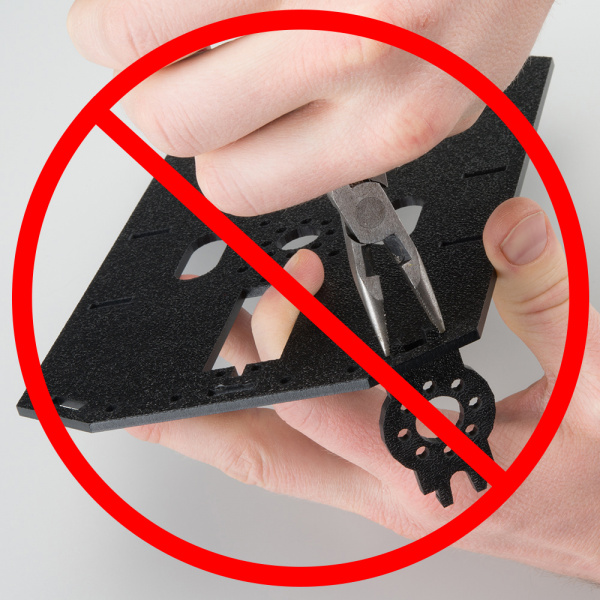](https://cdn.sparkfun.com/assets/learn_tutorials/3/3/7/Redbot_Kit-31_do_not.jpg) 

### A Note About Directions

- When this refers to the "front," "left," "right," and "back" of the  car, we are referring to specific sides of the robot when viewed from above.

 [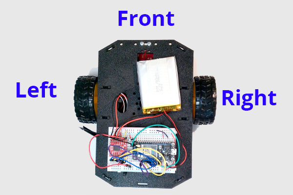](https://cdn.sparkfun.com/assets/learn_tutorials/3/3/7/Redbot_re-wired_shots-01.jpg) 

Notice that we consider the Breadboard to be on the "back" of the car.

## 2. Motors and Wheels

**NOTE:** Your motors might not be yellow. Worry not, they will work just as well!

### Locate the Following:

| **2x Front Motor Mount (C)**                                 | **2x Rear Motor Mount (D)**                                  | **2x Motor (K)**                                             |
| ------------------------------------------------------------ | ------------------------------------------------------------ | ------------------------------------------------------------ |
|  | [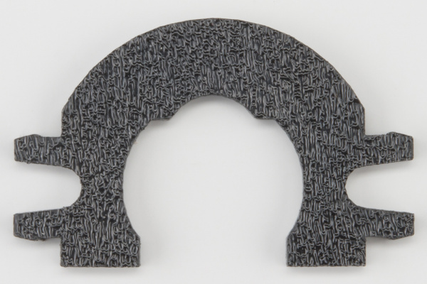](https://cdn.sparkfun.com/r/600-600/assets/learn_tutorials/3/3/7/Redbot_Kit-03.jpg) | [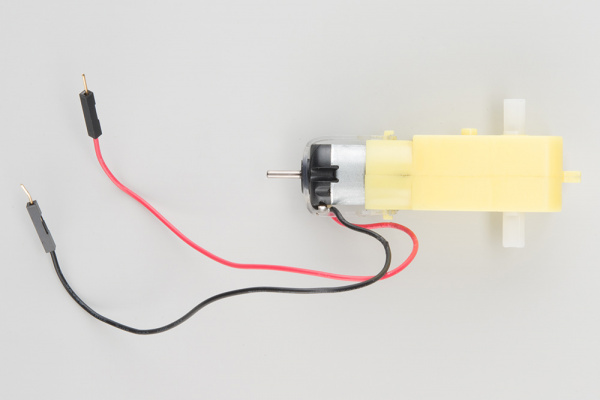](https://cdn.sparkfun.com/r/600-600/assets/learn_tutorials/3/3/7/Redbot_Kit-11.jpg) |
| **2x Wheel (L)**                                             |                                                              |                                                              |
| [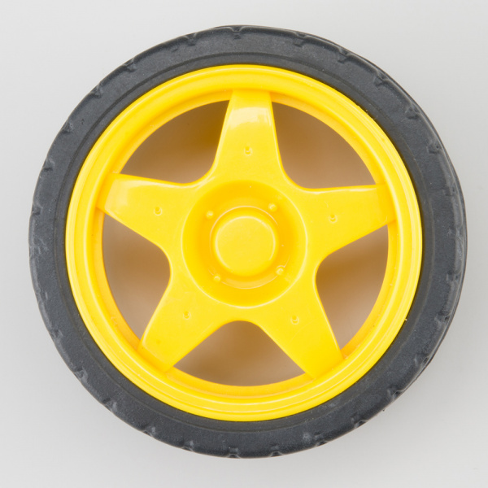](https://cdn.sparkfun.com/r/600-600/assets/learn_tutorials/3/3/7/Redbot_Kit-12.jpg) |                                                              |                                                              |

### Attach Rear Motor Mounts

Hold the wires near the middle of the Motor (K), and carefully slide a Rear Motor Mount (D) in from the side and over the two motor wires. Be  careful not to snag the wires, the cable tie, or the clear plastic  strap.

**NOTE:** The motors will **NOT ** have the donut shaped silver magnet on the end of the shaft that is shown in the pictures.

 [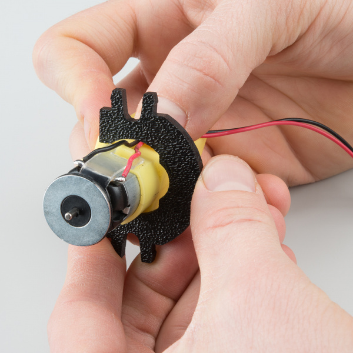](https://cdn.sparkfun.com/assets/learn_tutorials/3/3/7/Redbot_Kit-41.jpg) 

Holding the motor wires, gently twist the Rear Motor Mount counter  clockwise so that it snaps in place on the motor and the wires are  centered in the gap of the motor mount. Again, be sure not to snag the  wires under the motor mount.

 [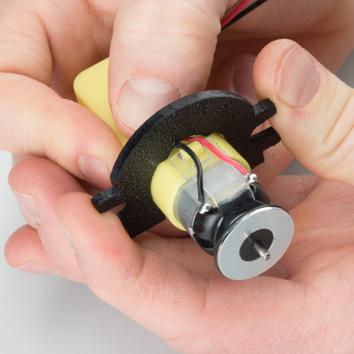](https://cdn.sparkfun.com/assets/learn_tutorials/3/3/7/Redbot_Kit-42.jpg) 

Repeat the process for the second motor.

 [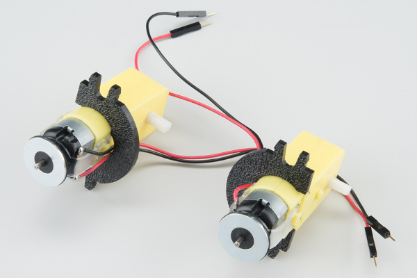](https://cdn.sparkfun.com/assets/learn_tutorials/3/3/7/Redbot_Kit-43.jpg) 

### Attach the Front Motor Mounts

Slide a Front Motor Mount (C) onto the protruding eyelet on the front of a Motor (K). Ensure the rounded sides of the motor mounts are facing the same way.

 [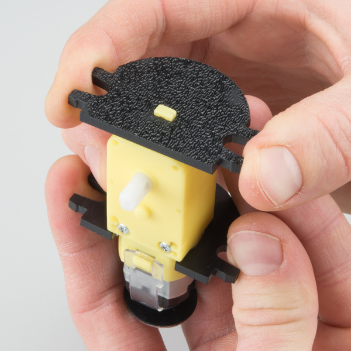](https://cdn.sparkfun.com/assets/learn_tutorials/3/3/7/Redbot_Kit-44.jpg) 

Repeat the process for the second motor.

 [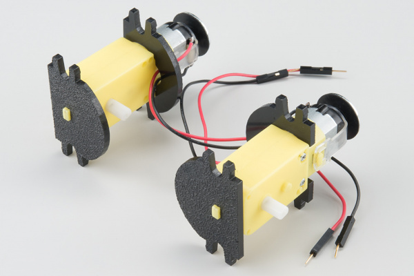](https://cdn.sparkfun.com/assets/learn_tutorials/3/3/7/Redbot_Kit-45.jpg) 

### Attach the Motor Assemblies to the Chassis

Snap one of the motor assemblies into the left 2 horizontal slots of  the Bottom Chassis Plate (A). Make sure that the rounded edges of the  motor mounts and the wires are facing toward the center of the chassis.

Snap the other motor assembly into the right 2 horizontal slots of  the Bottom Chassis Plate (A). Again, make sure that the rounded edges of the motor mounts and the wires are facing the center of the chassis.

 [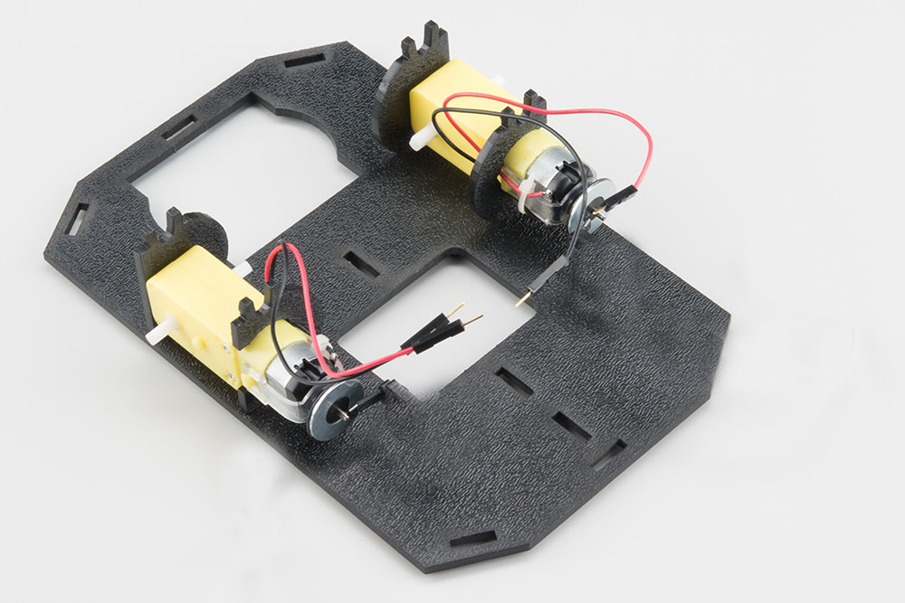](https://cdn.sparkfun.com/assets/learn_tutorials/3/3/7/Redbot_Kit_Brian_Revisions-09.jpg) 

### Attach the Wheels

Slide one Wheel (L) onto the plastic shaft of a Motor (K). Look at  the motor shaft. Notice it has two flat edges. Make sure to line up the  flat edges of the motor shaft with the flat edges of the wheel.

 [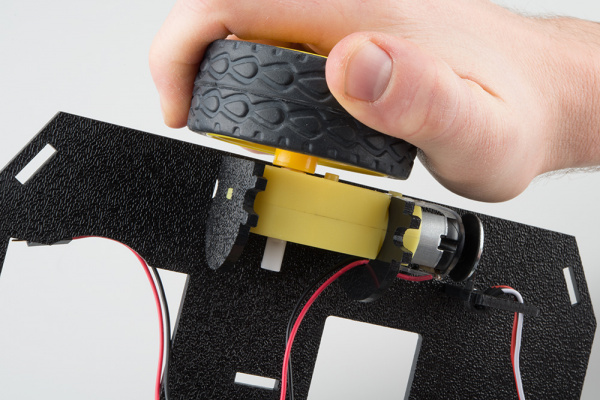](https://cdn.sparkfun.com/assets/learn_tutorials/3/3/7/Redbot_Kit-49.jpg) 

Repeat with the other wheel.

 [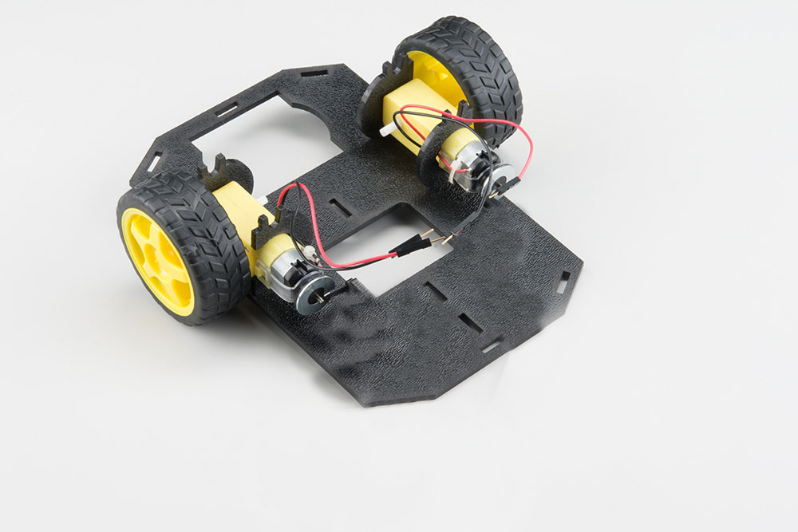](https://cdn.sparkfun.com/assets/learn_tutorials/3/3/7/Redbot_Kit_Brian_Revisions-08.jpg) 

## 5. Chassis

We can assemble the main body of the car

### Locate the Following:

| **4x Side Strut (E)**                                        | **1x Nub Caster (M)**                                        |      |
| ------------------------------------------------------------ | ------------------------------------------------------------ | ---- |
| [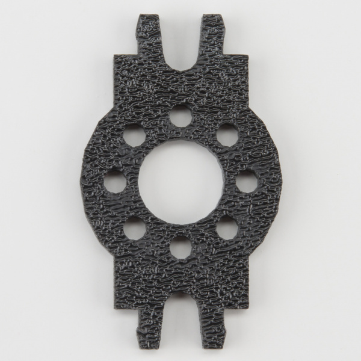](https://cdn.sparkfun.com/r/600-600/assets/learn_tutorials/3/3/7/Redbot_Kit-05.jpg) | [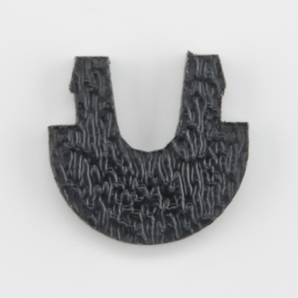](https://cdn.sparkfun.com/r/600-600/assets/learn_tutorials/3/3/7/Redbot_Kit_Reshoot-01.jpg) |      |

You will also need the **Top Chassis Plate** and **Bottom Chassis Plate** assemblies.

### Attach the Nub Caster

Snap the Nub Caster (M) into the slot on the back of the Bottom  Chassis Plate assembly. Make sure the Nub Caster is on the side opposite the motors (the bottom side).

 [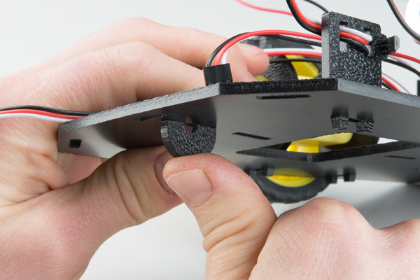](https://cdn.sparkfun.com/assets/learn_tutorials/3/3/7/Redbot_Kit_Reshoot-02.jpg) 

### Add the Side Struts

Snap the four Side Struts (E) into the diagonal slots on the four corners of the Bottom Chassis Plate assembly.

 [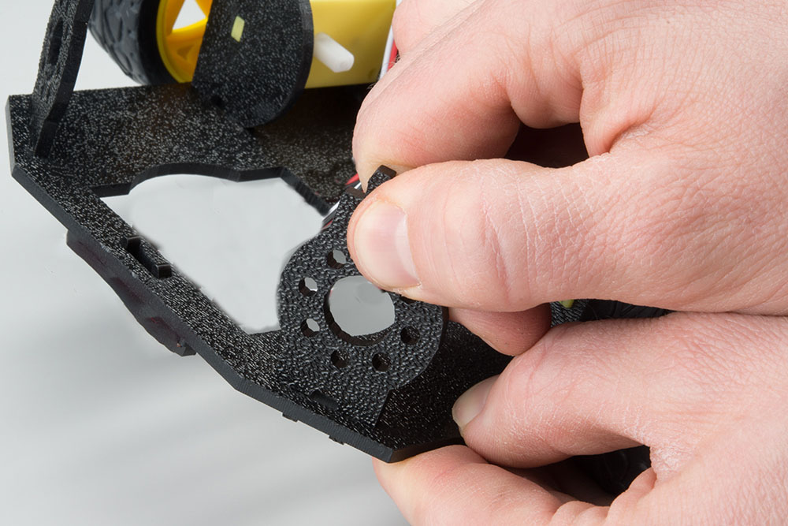](https://cdn.sparkfun.com/assets/learn_tutorials/3/3/7/Redbot_Kit-64.jpg) 

### Route the Cables

Position the Top Chassis Plate over the Bottom Chassis Plate -- but  do not snap the two plates together yet. Make sure that the front sides  of each plate line up.

Route the wires through the left and right oval slots in  the Top Chassis Plate assembly as shown.

**Note**: There are many wires shown in the photo, but our car will only have four wires (two for each motor)  

  

### Attach Top Chassis Plate Assembly

Line up the Top Chassis Plate on top of all the struts, and carefully snap the Top Chassis Plate assembly onto the side struts and motor  mounts. Press gently above each side strut individually until they each  snap into place. If you have the Bumpers installed, make sure the boards are between the top and bottom plates.

 **Note**: There are many wires shown in the photo, but our car will only have four wires (two for each motor)   

If you need to remove the plate to change anything, gently pull  upward on each side strut individually. Do not attempt to use pliers or  hand tools, or you may end up snapping the plastic clip.

## 6. Breadboard Mount

In this section, you will add the breadboard mount

### Locate the Following:

| **2x Breadboard Mount (G)**                                  |
| ------------------------------------------------------------ |
| [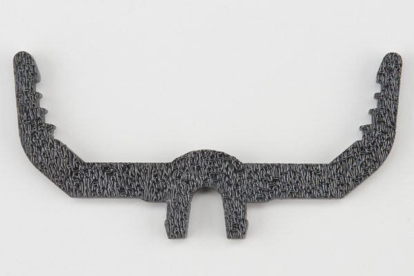](https://cdn.sparkfun.com/r/600-600/assets/learn_tutorials/3/3/7/Redbot_Kit-07.jpg) |

You will also need the full chassis assembly, which contains any additional parts and sensors you attached in previous steps.

### Attach the Breadboard Mounts

Snap the two Breadboard Mounts (G) into the vertical slots in the back of the top chassis plate near the large rectangular opening.

  

---

## 7. Attaching the Velcro

### Battery

* Place one small strip of velcro to the back of the battery 

### Chassis

- Place one small strip of velcro on the top side of the chassis near the front.

## 8. Connect Battery

*==Important: If you are working on another assignment concurrently, consider building the this project on a different breadboard==*

## 9. Build Circuit with Motor Controller

### Motor Controller Wiring Guide

| Motor Controller | Argon | --   | Motor Controller | Argon |
| ---------------- | ----- | ---- | ---------------- | ----- |
| PWMA             | D8    |      | VCC              | 3v3   |
| AIN2             | D7    |      | GND              | GND   |
| AIN1             | D6    |      | VM               | Li+   |
| BIN1             | D5    |      | STBY             | 3v3   |
| BIN2             | D4    |      |                  |       |
| PWMB             | D3    |      |                  |       |

### Wiring Diagram

* Note the diagram below uses two mini breadboard. This was because the diagram because the switch was move to keep the diagram readable.
* If you prefer, you use a single mini breadboard instead. You can do this by moving the switch onto the first breadboard between motor controller and the Argon

## 10. Connect Breadboard and Battery

* The Breadboard (P) snaps into the lowest of the notches on the Breadboard Mounts (G). Make sure the side of the motor controller that connects to the motors is facing toward the front of the card.
* Push gently and evenly until it snaps into place

- Attach the velcro on the battery to the velcro on the top of the chassis

## Conclusion

Congratulations! You've finished the chassis. **You will have parts leftover** so don't worry that you didn't use all the parts.

## References

* [Sparkfun](https://www.sparkfun.com/products/13301)
* [Sparkfun](https://learn.sparkfun.com/tutorials/assembly-guide-for-redbot-with-shadow-chassis)

