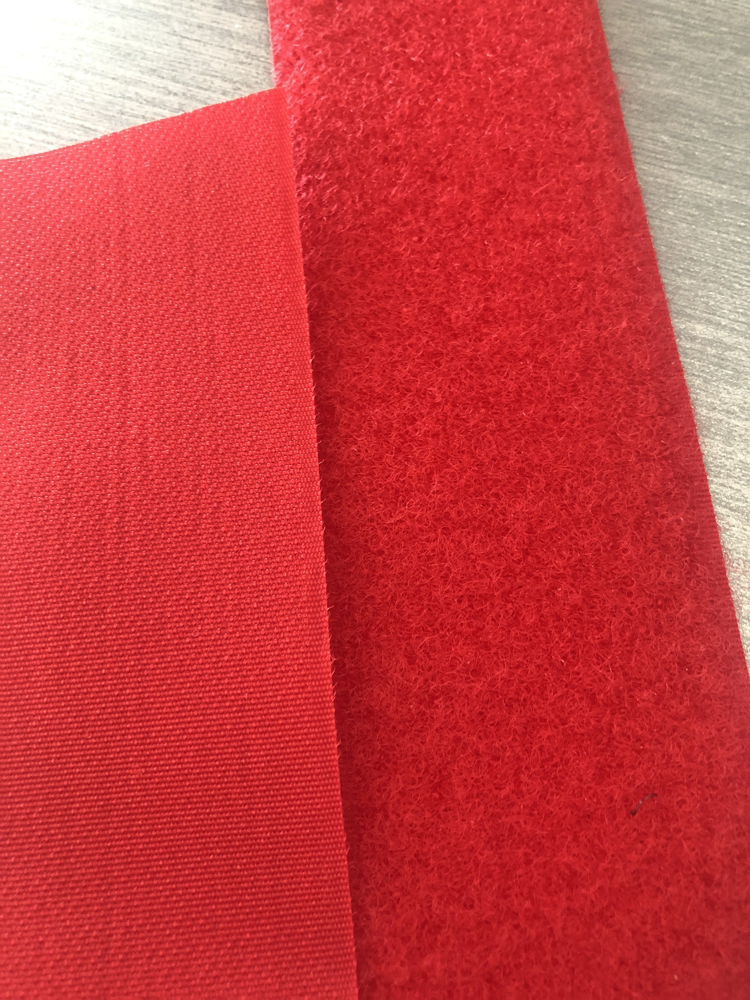
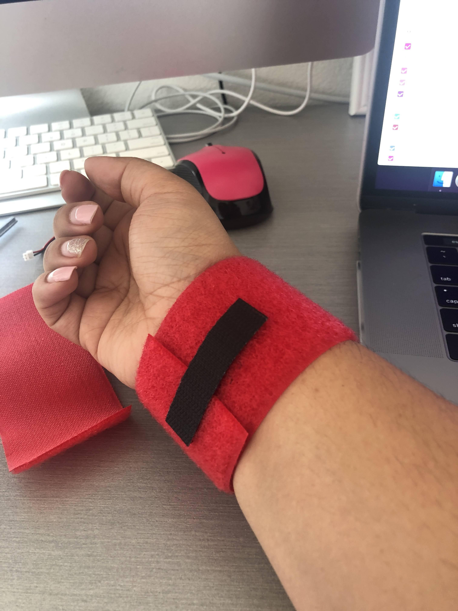
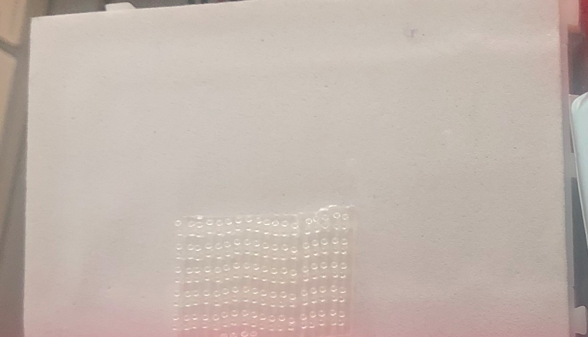
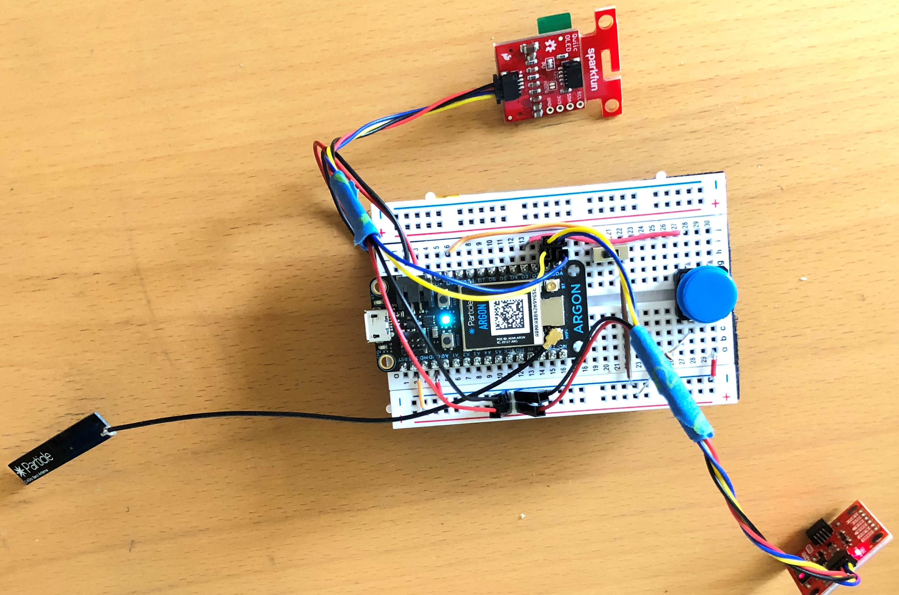

## Smart Watch Assembly

### Items You will Need: 

1. Scissors
2. Strip of red loop-side (soft) Velcro (2" x 14")
3. Strip of clear hook-side (rough) Velcro (1" x 10")
4. Small black strip of hook-side (rough) Velcro (1/2" x 2")
4. Breadboard
5. LiPo battery
6. Argon

### STEP 1:

Cut the red velcro to go around your wrist. The velcro will need to wrap around your wrist so make it longer at first to test. The strip should comfortably wrap around your arm. Then, attach the small black strip of velcro to one end. This will serve as the "clasp" of your smart watch. 

Note: Inspect the velcro and notice the two sides. You want the soft side (right side in picture below) with loops sticking out. The other side (left in picture below) is just a vinyl backing and isn't part of the velcro connection. The vinyl side should touch your wrist. 




### STEP 2:

Cut velcro strips. You will need 4 pieces of velcro (2 for the battery and 2 for the breadboards). You might want to look ahead before you do this step; if you already have velcro attached to your battery and breadboard, you won't need to cut all of these strips.

* 1 or 2 - 1"x1" squares
* 2 - 2"x1" strip 

### STEP 3:

Attach a 2"x1" strip of velcro to the LiPo battery (may have been done in a previous project). Place a 1"x1" square of velcro in the center on top and bottom of the battery. Wrap the red velcro strip around your wrist so that it is clasped and comfortable. Take note of where the "center" is, and attach the battery there with velcro. 


### STEP 4:

Attach velcro to bottom of breadboard (may have been done in a previous project). Carefully peel off adhesive covering on bottom of breadboard (**don't take off actual foam-like adhesive**) and place a 1"x1" square of velcro on the bottom of the breadboard. If you want you can also attach a piece of paper or cardboard to the bottom for the breadboard before attaching the velcro.

Connect the breadboard with velcro on the bottom to the velcro on the top of the LiPo battery.
*Breadboard with velcro*

*Battery with velcro and strap*

*Breadboard, battery, and strap*


### Step 5:

Wire the components. 

*OLED Wiring with Qwiic* 

```c++
MicroOLED --------------- Argon
  GND ------------------- GND
  VCC ------------------- 3.3V
  SDA (blue) ------------ SDA
  SCL (yellow) ---------- SCL
```

*Additional Wiring*

```c++
Button: D3
Switch: 
  Pin 1 -- GND
  Pin 2 -- EN
```


*Fritzing design*


### Completed Assembly

*Note: These photos feature a slightly different OLED screen, but the overall design is the same*




## Credits

* Diagrams made with [Fritzing](https://fritzing.org/home/)

