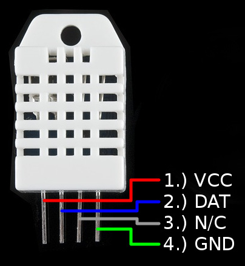
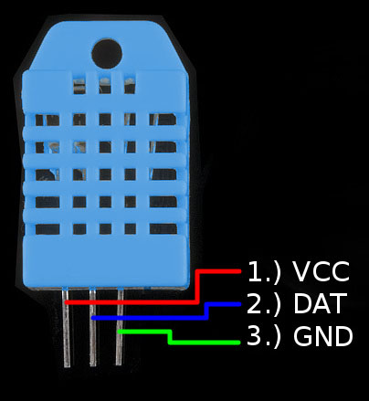

<!-- headingDivider: 2 -->

# DHT11 - Temperature and Humidity Sensor

  

## Sensor Type

**Important!** There are different styles of DHT sensors, and they need to be connected and programmed differently. Make sure to verify which sensor you have before proceding.

## Digital Temperature and Humidity Sensor

* DHT 22 (also DHT 11, RHT 03) measure temperature and relative humidity
* Unlike TMP36, this has a digital interface and no calculation or conversion is needed

## Wiring Guide - 4 Pins
 

1. 3.3V
2. Digital input (needs 10k pull-up resistor)
3. No connection
4. Ground


## Wiring Guide - 3 Pins

 

1. 3.3V
2. Digital input (needs 10k pull-up resistor)
3. Ground
## Wiring


## Software Library

* The DHT11 uses a protocol called **1Wire** to send data
* In order to communicate with the device, we will need to use a special library 
* The Argon-compatible library we will use is
  ```PietteTech_DHT```


## Library Setup

```c++
#include "PietteTech_DHT.h"
```

```c++
#define DHTPIN D3		//DHT data pin
#define DHTTYPE DHT11	//specific DHT model we have
PietteTech_DHT dht(DHTPIN, DHTTYPE); //DHT software object
```
*  Available options for `DHTTYPE` 
  * `DHT11`, `DHT21`, `DHT22`, `AM2301`, `AM2302`
  * The blue sensor in our kit is a `DHT11`

## ```setup()```

```c++
//initialize DHT software object
dht.begin();
```

## Wait for Data and Error Checking

```c++
int result = dht.acquireAndWait(1000);  // wait up to 1 sec
if (result == DHTLIB_OK) {
	//read values here
}
```

## Reading Values

```c++
// Read humidity
float h = dht.getHumidity();
// Read temperature as Celsius
float t = dht.getCelcius();
// Read temperature as Farenheit
float f = dht.getFarenheit();
```

## Other Methods

```c++
float dp = dht.getDewPoint();
float k = dht.getTempKelvin();
```

## Full Example

```c++
#include "PietteTech_DHT.h"

#define DHTTYPE DHT11  // DHT model you have
#define DHTPIN D2      // DHT data pin

PietteTech_DHT dht(DHTPIN, DHTTYPE);

float h;
float c;
float f;

unsigned long prevMillis = 0;
unsigned long updateDelay = 2500;

void setup() {
  Serial.begin(9600);
  dht.begin();
}

void loop() {
    unsigned long currMillis = millis();
    if (currMillis - prevMillis > updateDelay) {
        prevMillis = currMillis;
		
		int result =
			dht.acquireAndWait(1000);  // wait up to 1 sec 
		if (result == DHTLIB_OK) {
		  h = dht.getHumidity();
		  c = dht.getCelsius();
		  f = dht.getFahrenheit();
		  Serial.println("Humidity: " + String(h, 1) + " %");
		  Serial.println("Temp (F): " + String(f, 1) + " deg F");
		  Serial.println("Temp (C): " + String(c, 1) + " deg C");
		} else {
		  Serial.println("Invalid reading");
		}
	}
}


```

## Notes

* Always wait about 2.5 seconds in between measurements (use `millis` preferably for this instead of `delay`)

## Credit

* [Sparkfun](https://www.sparkfun.com/products/10167)
* Diagrams created with [Frizting](https://fritzing.org)


