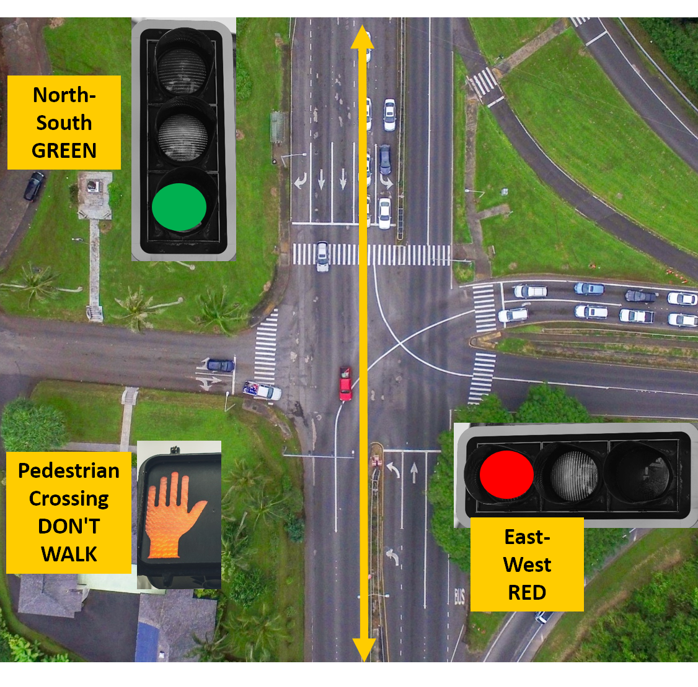
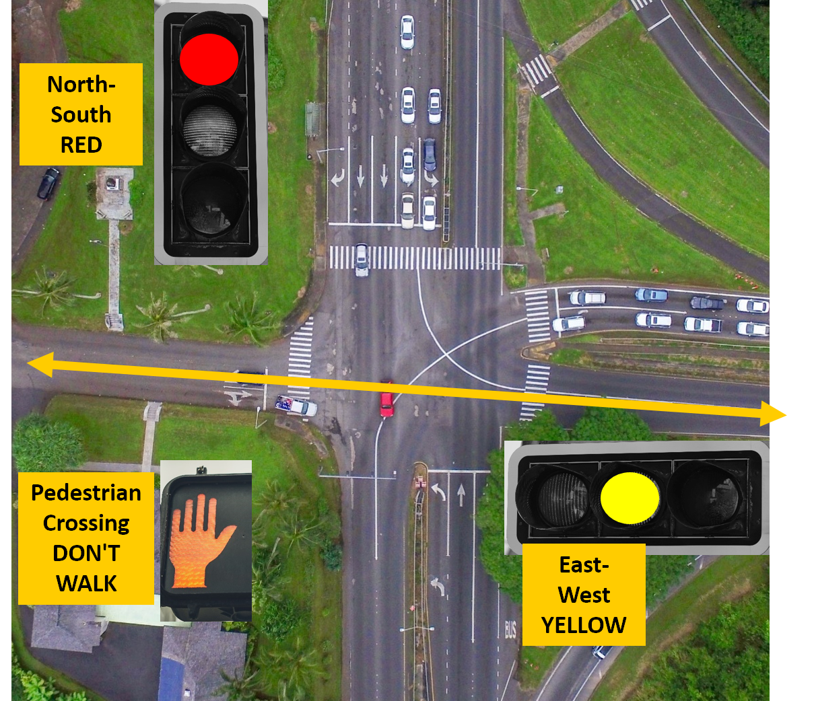
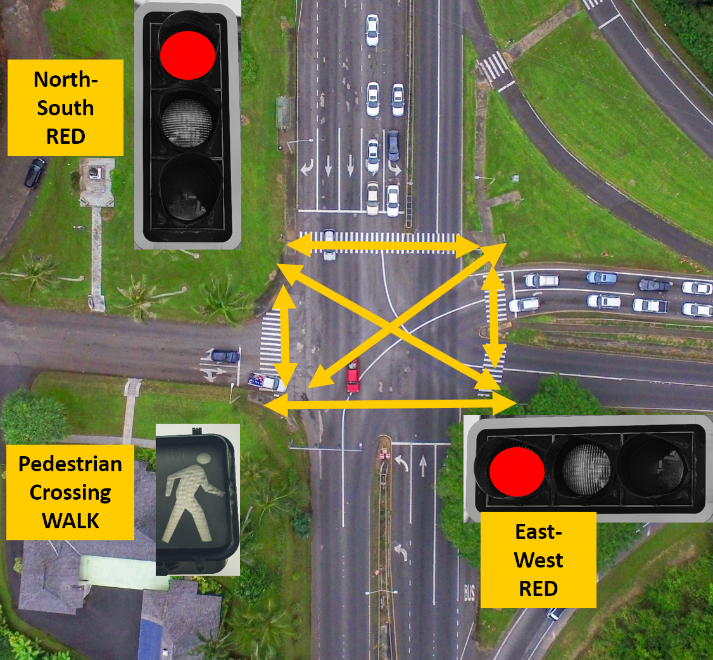

<!-- headingDivider: 2 -->

# State Machines
## In class Lab - Stoplight and Pedestrian Signal

 

## In class Lab - Stoplight and Pedestrian Signal

* We are going to build a stoplight for a two way intersection with a diagonal pedestrian crossing (meaning all traffic stops)
  * also known as a pedestrian scramble
* Here is how this type of intersection works

## 


## 


## 


## 



## 



## In class Lab - Stoplight and Pedestrian Signal


* Download starting code
  * Go to [https://bit.ly/ProjectZip](https://bit.ly/ProjectZip)
  * Paste the following link into the top right
```https://github.com/reparke/ITP348-Physical-Computing/tree/master/_exercises/week07/stop_light_start```
* Wire device as shown below

## Wiring Diagram


## Wiring Diagram

You'll need

* 2 green LEDs
* 2 yellow LEDs
* 3 red LEDs
* 1 white LED
* 6 330 Ohm resistors

<!--  -->

## Wiring Pin Guide

| LED                   | Argon Pins |
| ---------------------------- | ---- |
| NorthSouth Red LED      | D2     |
| NorthSouth Yellow LED  | D3      |
| NorthSouth Green LED  | D4      |
| WestEast Red LED    |   A0   |
| WestEast Yellow LED  |     A1 |
| WestEast Green LED   | D5     |
| Walk White LED     |  D6    |
| Don't Walk Red LED   |  D7    |

## Lab Stages
1. North South stop light
2. Add Pedestrian Walk / Don't Walk light
3. Make Don't Walk light blink
4. Add West East stop light

* We will work through stage 1 together
* You will work in pairs implement stages 2-4, and we will review together as a class after each stage

## General Approach

* We will need to create a way to represent the states using `enum`
* We will need to track state transitions with **variables** for state
* We will need to control timing with `millis()`

* What does `loop()` do
  * calculate new state
  * output traffic signal LEDs based on state
  * independently flash walk signal *(later)*

## Credits

* [Bill Siever](http://siever.info) - [CS132 FSM](http://siever.info/cse132/guides/intro-to-FSMs.html)  (Washington University at St. Louis) 
* [Bill Siever](http://siever.info) - [CS132 Delta Timing](http://siever.info/cse132/weeks/3/)  (Washington University at St. Louis) 
* [USC EE109 State Machines](http://bits.usc.edu/files/ee109/)
* Photo by Laurie Parke
* Photo by [Michael Olsen](https://unsplash.com/@mganeolsen)</a> on [Unsplash](https://unsplash.com/)
* Photo by [Free To Use Sounds](https://unsplash.com/@freetousesoundscom?utm_source=unsplash&utm_medium=referral&utm_content=creditCopyText) on [Unsplash](https://unsplash.com/?utm_source=unsplash&utm_medium=referral&utm_content=creditCopyText)
* Photo by [NON](https://unsplash.com/@non_creation?utm_source=unsplash&utm_medium=referral&utm_content=creditCopyText) on [Unsplash](https://unsplash.com/?utm_source=unsplash&utm_medium=referral&utm_content=creditCopyText)