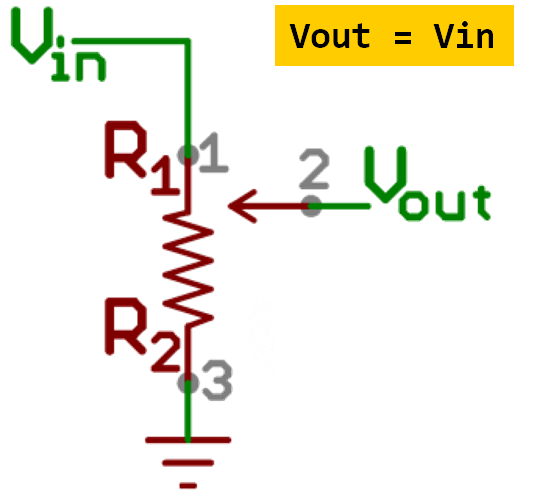
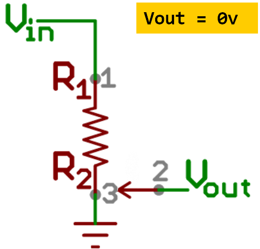

<!-- headingDivider: 2 -->

# Measuring Light with Photoresistors
### TAC 348 - Making Smart Devices

## Learning Objectives
* Describe what a photoresistor measures and what it is used for
* Understand voltage divider concept behind photoresistor operation
* Implement a device using photoresistor
* Calibrate photoresistor with appropriate values in firmware

## Part 1: Understanding a photoresistor 

* Working in breakout groups, answer the following questions in **Part 1**

## Part 1: Understanding a photoresistor 

1. A photoresistor is a device whose resistance varies with the amount of light present. Which input function will we use for reading? `analogRead` or `digitalRead`? __

2. Based on you answer to #1, what is the range of values the argon will see when reading the input from photoresistor.

   * What is the maximum value the argon will read?  __ <!-- 4095 -->
   * What is the minimum value the argon will read?  __ <!-- 0 -->

## Part 1: Understanding a photoresistor 

3. With the photoresistor <u>not</u> connected to the argon, use multimeter to measure resistance of photoresistor under the following conditions.

   * Resistance in ambient (normal) room light: __ <!-- 2k -->
   * Resistance in bright light (cell phone light): __ <!-- 500 -->
   * Resistance in darkness: __ <!-- 9k -->

## Part 1: Understanding a photoresistor 

4. Connect photoresistor to **3.3v** and **GND** as shown below. 
    

## Part 1: Understanding a photoresistor 

5. Using a multimeter, measure voltage in ambient room light: __ <!-- 3.3v -->

6. Using a multimeter, measure voltage in bright light (cell phone light): __ <!-- 3.3v -->

7. Using a multimeter, measure voltage in darkness: __ <!-- 3.3v -->

8. What do you notice? __ <!-- The voltage is always the same-->

9. Why do you think this is? __ <!-- The resistance varies, but the voltage drop is always the same by KVL -->

##  Part 2: Discuss Together

* What do you learn? 
* Did this work as you expected?

## Review: Potentiometers

* A **potentiometer** is also a variable resistor (like a photoresistor).
* When the potentiometer's **resistance** varied, we were able to "see" (read) a voltage change (unlike with the photoresistor)
* Why was that?
   <!-- The pot has three terminal which creates a voltage divider; there are two different "resistors" and we are measure the ratio of the two -->

* Is there a way we could use a similar approach to measure voltage changes with the photoresistor? __ <!-- use a fixed second resistor -->

## Review

<!-- 
 -->

* Inside the potentiometer is a wiper can move across a fixed resistor
* **Vout** represents the voltage at wiper
* As the knob moves the wiper across the resistor,  the ratio of resistance between ***Vin-and-Vout*** and ***Vout-and-Gnd*** varies

## Review
* As those resistances changes, so does the **voltage** difference between ***Vin-and-Vout*** and ***Vout-and-Gnd***
* This is known as a **voltage divider**
  

<!-- 
 -->

## Photoresistor Problem

* Since the potentiometer wiper divides the internal resistor, it *effectively* creates two resistors 
* We can measure the change between those two resistors
* However, without a second resistor in our photoresistor circuit, we can not measure differential change

## Photoresistor solution

## Photoresistor solution

* Use a fixed resistor (usually 4.7k*) in series with photoresistor
* Connect one end of photoresistor to 3.3v, and the end to the resistor
* Connect the other end of the resistor to ground
* Use the Argon to measure the voltage in the middle 

**\*** *4.7k is not a magic value. It a reasonably good value for normal lighting conditions*

## Lab

## Lab

* Work in breakout groups
* Read and display the voltage between the photoresistor and resistor.
* Measure it based on different lighting conditions: normal room light, covering the sensor with your hand, shining
* Display on the serial monitor if you room light **dark**, **light**, or **ambient**
   * Hint: how will you determine what type of light is present?

## Credit

- [Sparkfun](https://www.sparkfun.com/products/9088)
- [Sparkfun](https://www.sparkfun.com/products/9806)
- Images created with [Fritzing](https://fritzing.org/home/)
