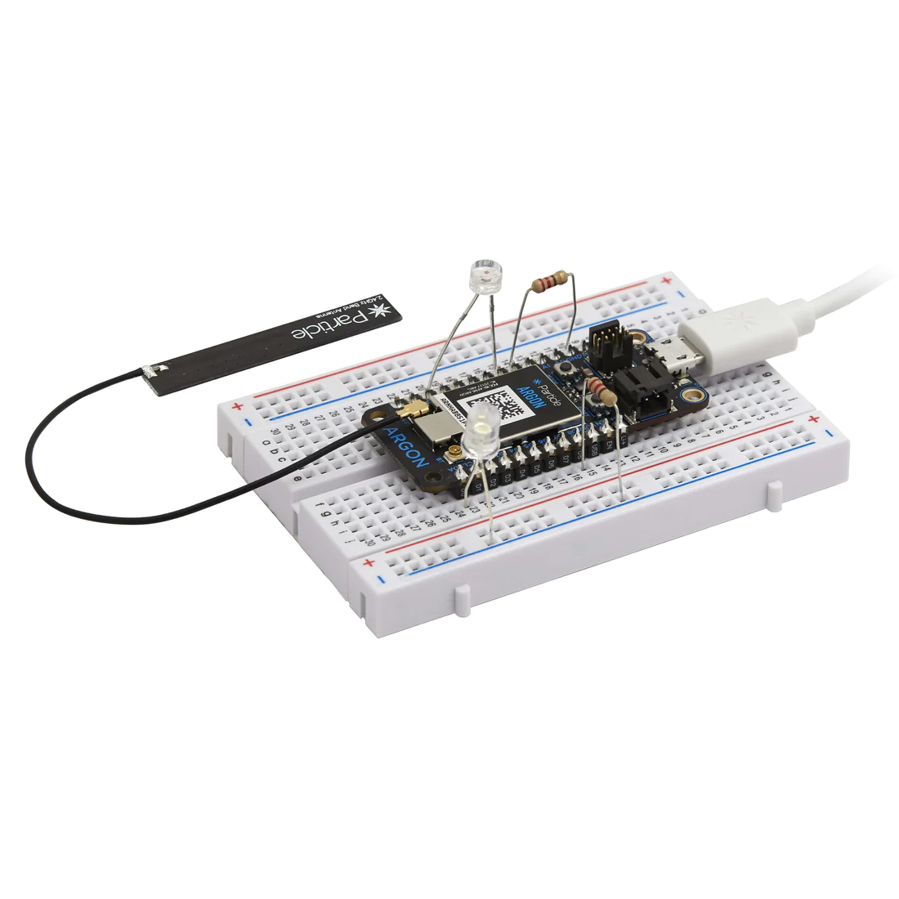

<!-- headingDivider: 2 -->

# Argon Microcontroller


## Microcontroller

* Microcontrollers (MCU) are **embedded** computers
* They are often designed for a specific purpose 
  - Ex: a microwave, an RC car, TV remote'
* Like your laptop, microcontrollers can take input, process it, store a value, and produce output
* Unlike your laptop (or even your phone), a microcontroller has very limited processing power and storage 
* Ex: The newer smartphones have 100,000 times more storage than the Argon

## Particle Argon

* In this class, we will develop projects for a microcontroller called an **Argon** made by **Particle**
* The Argon is able to wirelessly connect to the internet and to Bluetooth 
* Particle also has a cloud communication system we will explore later in the semester

## Datasheet

* One important skill of building smart devices is learning to understand a datasheet
* A datasheet explains how a component functions, how to use it, what conditions it will operate, etc.
* Don't worry about understanding everything in a datasheet, but learn to pull out key information

- [Argon Datasheet](https://docs.particle.io/datasheets/wi-fi/argon-datasheet/)

## Work in pairs and answer the following

1. What voltage does the Argon operate at?
2. Which IC (integrated circuit) is the "main" processor?
3. Which IC controls the Wifi module?
4. What is the difference between pins `3v3` and `VUSB`?
5. How many digital input pins are there? 
6. How many analog output pins are there?
7. How many ground pins are there?
8. What is the voltage that the input pins can handle?
9. Can we power the Argon with battery?

## Datasheet 


- [Argon Pinouts](https://docs.particle.io/assets/images/argon/argon-top.png)

- [Argon Datasheet](https://docs.particle.io/datasheets/wi-fi/argon-datasheet/)

<!-- operating voltage: 3.3v -->

<!-- main: nRF52840; wifi: ESP32 -->

<!-- 3v3 is always 3.3v; VUSB is 5v when connected to USB-->

<!-- 20 digital GPIO; 6 analog IN; 0 analog out; 1 ground pin -->

<!-- GPIO can operate at 3.3V max so be caution with higher voltage devices -->

<!-- show other communication pins -->        


## Structure of Argon Programs

* We will use Particle Workbench as our IDE
* We will write software code that runs on the Argon
  * Programs that run on microcontrollers are called **firmware** 

## Important Note

* Your Argon folder name cannot contain any spaces at all
  - `C:\Users\Rob\ITP-348\Projects` is ok
  - `c:\Users\Rob Parke\ITP 348\Cool Projects` is not

## Key features

* Argon programs are written in C++ *(please see review link on course website for C++)*
* Every Argon program **must** have these two functions *(you can other ones too)*
  - `setup()`
  - `loop()`
* In addition, most programs will also have
  - global variable declarations
  - library includes

## Example program

```c++
#include "OLED_screen.h"	//library

const int MAX_PRESSES = 4;	//globcal constant
int numPresses = 0;			//global variable

void setup() {
  // put your setup code here, to run once:
}

void loop() {
  // put your main code here, to run repeatedly:
}
```

## Libraries

```c++
#include "OLED_screen.h"
```

* Similar to `import`
* Allows us to access additional code and functions
* We will use this to communicate with certain devices like LCD screens
* Notice the `#`

## Variable Declaration

```c++
const int MAX_PRESSES = 4;	//globcal constant
int numPresses = 0;			//global variable
```

* Typically, many of our variables will be global (declared outside a function in the global namespace)
* In C++, every variable must *explicitly* declare it's

## `setup()` Function

```c++
void setup() {
  // put your setup code here, to run once:
}
```

* The `setup()` function will ***only run once***
  - Runs after each powerup or reset the Argon
* Use it to initialize variables, pin modes, start using libraries, etc.

## `loop()` Function

```c++
void loop() {
  // put your main code here, to run repeatedly:
}
```

* After `setup()` is called once, the`loop()` function is called endlessly 
  - Basically an infinite loop
* Use it for the main functionality of your program