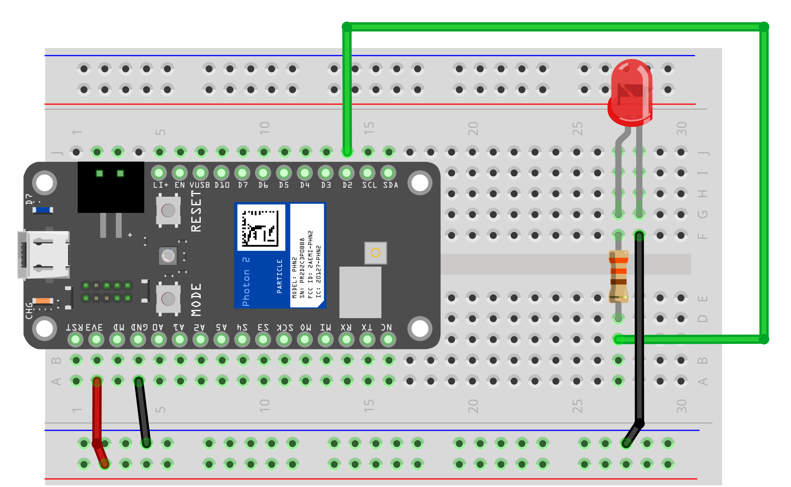
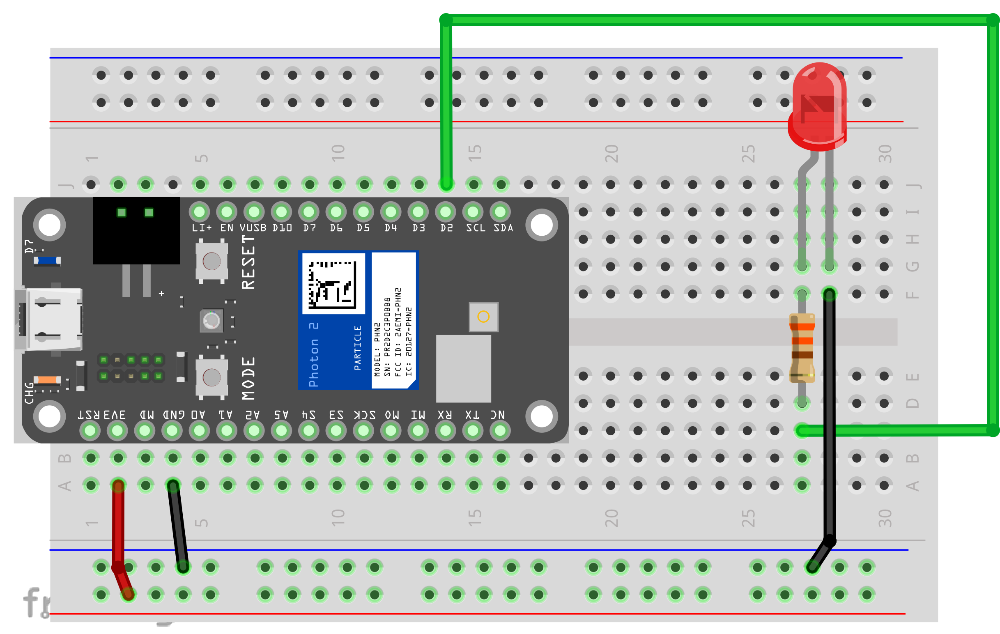

<!-- headingDivider: 2 -->

# LEDs - Light Emitting Diodes


## LEDs

* Light emitting diodes are basically small light bulbs (but use significantly less power) 
* LEDs are everywhere!
  - (Nearly) all the blinking lights around us (e.g. router, washing machine, etc.)
  - Smartphone flash
  - TV remotes (infrared LEDs)
  - Energy-efficient light bulbs
  - Some displays

## How LEDs Work


## How LEDs Work

* Light emitting diode is made of two layers of semiconducting material
* When the voltage at the anode (longer leg) is about 2.2v *more than* the voltage at the cathode (shorter leg), the LED emits light
  - This positive voltage difference is called **forward biasing**


## LEDs are Directional (aka Have Polarity)

* LEDs allow current to flow **in only one direction**
* If positive voltage is applied to the anode, light will emit
* If positive voltage is applied to the cathode, light **will not** emit (aka the polarity is reversed)


## LED Precautions

* LEDs have limitation in how much current they can handle
* More current = brighter light *...up to a point, and then the LED breaks*
* This is why we use a **resistor** to limit the flow of current
* We call this a **current limiting resistor**
* The resistor can be *before* or *after* the LED in the circuit

## Exercise

* What do you think will be the difference between using 10KOhm resistor vs 330 Ohm resistor?

## LED Datasheet

<!--go through this together -->

- [Datasheet](https://www.sparkfun.com/datasheets/Components/LED/COM-09590-YSL-R531R3D-D2.pdf)  
- Forward Current
- Peak Forward Current
- Forward Voltage

<!-- forward voltage is the voltage drop across the LED
forward current is current the LED can handle-->

## Choosing a Current-Limiting Resistor

* Rule of Thumb: 330 Ohms or 220 Ohms are common options
  - For this class, go ahead and use whichever is available
* Why? 

<!-- We haven't discussed KVL -->
<!-- USB power is 5v. Datasheet shows LED has forward voltage 2v (3v remain). Max current is 30 mA, but good practice is use about half of that. Using V=I*R with 3v and 15 mA, R is 200 Ohms. Larger resistance is fine. Typically, 220 and 330 are common values-->

## Let's turn on LED without any Code

* We can "hardwire" an LED to turn on by connecting the anode (long side) to a +3.3V and the cathode (short side) to ground
* The LED is **always on** because the anode is always at +3.3V and the cathode is always at ground

## Wiring



## Turning on LEDs in Code

* We need to be able to control the voltage at the anode so it can be either +3.3V (LED turns on), or GND (LED turns off)
* Connected anode to pin D2 on Argon
* Connected cathode to GND
* Now using code, we can make the voltage at pin D2 either +3.3V or GND 

## Wiring



## Digital Output

* These are signals that are HIGH or LOW
  - **HIGH** is **5V** (pin `VUSB`) or **3.3V** (pin `3v3`)
    - HIGH is considered "true"
  - **LOW** / false is **0V** (ground)
    - LOW is considered "false" 

## Setting input / output with `pinMode` 

Syntax

```c++
pinMode(PIN_NUMBER, MODE);
//MODE: OUTPUT or INPUT
```

* Before we can use pins on the Argon, we need to specify if pins will be used for **input** or **output**
* Most pins on the Argon can be configured to SEND output (e.g. to turn on a light) or to RECEIVE input (e.g. a button press)
* When you want to use a pin in your program, you should specify its mode in `setup()`


## Writing Digital Output with `digitalWrite` 

Syntax

```c++
digitalWrite(PIN_NUMBER, VALUE);
//VALUE: HIGH or LOW
```

* You can send an ON (HIGH) or OFF (LOW) signal at output on a pin
* This is writing a **digital** value
  - Digital values are like boolean values: 0/1, on/off, true/false


## Credits

* <a href="//commons.wikimedia.org/wiki/User:Afrank99" title="User:Afrank99">Afrank99</a> - <span class="int-own-work" lang="en">Own work</span>, <a href="https://creativecommons.org/licenses/by-sa/2.0" title="Creative Commons Attribution-Share Alike 2.0">CC BY-SA 2.0</a>, <a href="https://commons.wikimedia.org/w/index.php?curid=248198">Link</a>
* <a href="https://creativecommons.org/licenses/by-sa/3.0" title="Creative Commons Attribution-Share Alike 3.0">CC BY-SA 3.0</a>, <a href="https://commons.wikimedia.org/w/index.php?curid=755036">Link</a>
* Images created with [Fritzing](https://fritzing.org/home/)

