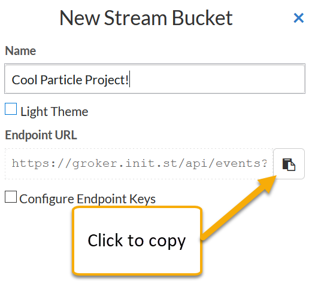
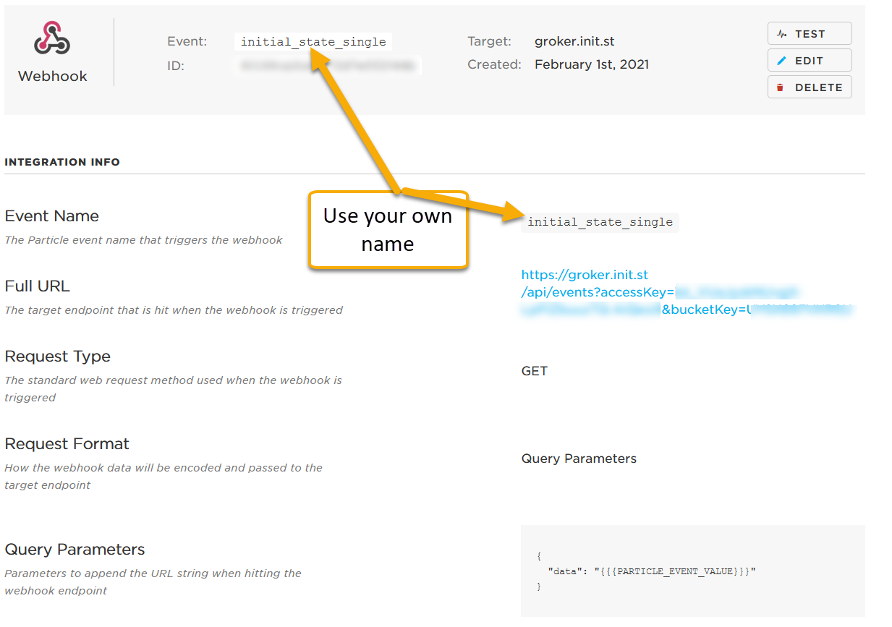
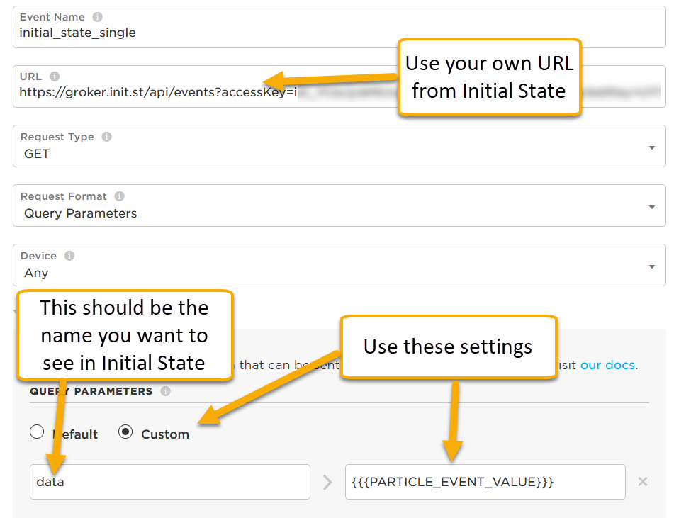

<!-- headingDivider: 2 -->

# Data Visualization and Dashboards with Initial State 


## What do we do with all this data?

* A single IoT device can generate significant of sensor data
* A fleet of thousands of devices compounds this
* A **dashboard** can help provide visual feedback and control over our IoT devices and data

## Example Environmental Dashboard


## Uses of Dashboards

* View real-time sensor data
* Compare data to historical trends
* Monitor IoT devices for errors or network issues
* Map devices GPS location
* Remote control (execute functions) on devices

## Dashboard Platforms

* [Google Cloud IoT](https://cloud.google.com/solutions/iot) (many IoT services)
* [Microsoft Azure IoT](https://azure.microsoft.com/en-us/overview/iot/) (many IoT services)
*  [Amazon Web Services](https://aws.amazon.com/iot/) (many IoT services)
* [Losant](https://www.losant.com/) (many IoT services)
* [Ubidots](https://ubidots.com/)
* [Tinamous](https://www.tinamous.com/)
* [Initial State](https://www.initialstate.com/)

## Initial State ([https://initialstate.com](https://initialstate.com))

* Initial State is a data visualization service for IoT
* Send data from Argon to be stored at Initial State 
* Create complex graphs and dashboard with the values from your Argon
* Generous free tier!
* Initial State can also send SMS and email alerts based on the data (though this requires a paid plan)

## Configuring Argon and Initial State 

* The following examples are provided as a quick reference
* More detailed steps are described in the lecture 

## Steps to Connect Argon and Initial State 

1. Create account at  [https://initialstate.com](https://initialstate.com) (make sure to use your student email and change ) 
2. Create **stream bucket** at [https://initialstate.com](https://initialstate.com)  
3. Create an integration -> webhook on [Particle console](https://console.particle.io/integrations) 
4. Write firmware sketch and flash Argon

## Aside: Access Key (or API key)

* Many webservices require you to register and then they provide you with an API key (ex: `zaCELgL. 0imfnc8mVLWwsAawjYr4Rx-Af50DDqtlx`)
* This randomly-generated string serves as the login and password (credentials) to your account
* Purposes
  * Account security (no one but you can read / write data)
  * Prevent abuse / hacking
  * Throttling / account limits (enforce limits on read/write frequency)

## Example 1: Send Single Data Point from Argon to Initial State

**Initial State Settings**




## Example 1: Send Single Data Point from Argon to Initial State

**Particle integration settings**



## Example 1: Send Single Data Point from Argon to Initial State

**Particle integration settings**

 This code below is because Liquid breaks with the triple brackets 

`YOUR_CUSTOM_DATA_LABEL `     >      `{{ liquid_code_block }}`





## Example 1: Send Single Data Point from Argon to Initial State

**Argon code**

```c++
double temp;

void loop() {
  temp = 89;		//just example; temp should come from sensor
    
  // Trigger the integration
  Particle.publish("inital_state_single", String(temp), PRIVATE);
  delay(60000);	//use delay or millis to avoid publishing too frequently
}
```


## Lab - Send Temperature Value to Initial State

* Connect TMP 36 to Argon
* Read temperature value and send to Initial State

## Lab - Send Temperature Value to Initial State


## Credits

* [Growthlakes](https://commons.wikimedia.org/wiki/File:Infruid%27s_Self-Service_BI_Tool_Dashboard.jpg)  [CC BY-SA](https://creativecommons.org/licenses/by-sa/4.0)
* Image created with [Fritzing](https://fritzing.org)