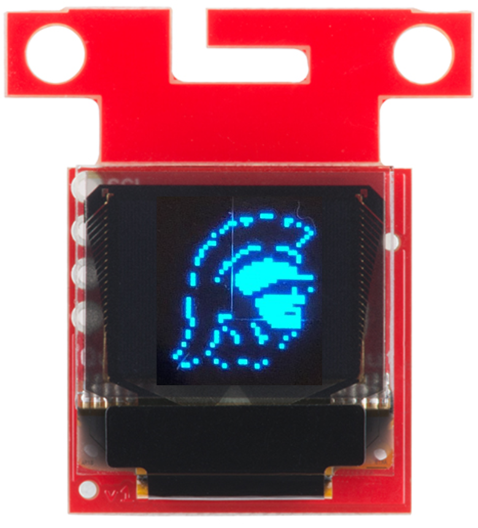

<!-- headingDivider: 2 -->

<!-- reference for library api
https://learn.sparkfun.com/tutorials/micro-oled-breakout-hookup-guide#using-the-arduino-library -->

# OLED Screens and I2C Communication
### ITP 348 - Making Smart Devices


## Learning Objectives
* Explain what synchronous, serial communication means
* Understand key concepts behind I2C protocol
* Identify OLED configuration parameters by reading through datasheet and software library 
* Implement OLED screen in a device


## Improving Output
* Serial monitor is fine for debugging, but we need better output to build a device

* Let's introduce one output device

  
  
  ## Introducing Organic Light-Emitting Diodes


## OLEDs

OLEDs are more complex than regular LEDs and be manufactured to be thin and bendable

* OLEDs are used in high end TVs, monitors, and phones
* OLEDs are more expensive than regular LEDs

## Our Micro OLED has two components


## OLED screen




* Blue text on black screen
* 64 pixels (W) x 48 pixels (H)
* Operates at 3.3v
* Controlled via I2C protocol *(more on this later)*
* 31 pins (!) 


## Breakout Board


* Custom circuit board that provides access to ("breaks out") the **very delicate** small pins on the screen
* This breakout board also enables the communication protocol that allows us to use only 2 pins to connect to the Argon


## Communication

* Communicating with the screen directly is complicated but we can use a library to simplify 
  * This is similar to installing software on your computer to communicate with your printer (*software driver*)
* Argon can communicate with the screen using a protocol called **I2C**

## What is Synchronous Communication?


## Synchronous Communication

* Clock pin and data pin(s)
* Clock is an oscillating square wave
* Receiver reads **data** signal on **clock** rising edge *(low to high)* 
* **Synchronous:** data sent on regular intervals controlled by a clock
* **Serial:** one bit at time is sent / received

## I2C

* Inter-integrated Circuit  (I2C) is a protocol to allow a central device to communicate with multiple "peripheral" chips
* Serial
* Synchronous
* Only two pins
  * Data (```SDA```)
  * Clock (```SCK```)

## I2C Cable


- Sparkfun uses a custom cable and connector for its I2C devices called **Qwiic**
- Instead of connecting individual wires, you can connect a single cable
- Black (`GND`)
- Red (`3.3v`)
- Blue (```SDA```)
- Yellow (```SCK```)


## I2C

- Advantages
  - Uses only 2 wires (other protocols require 4 or more)
  - Standardized across many components
- Disadvantages
  - Uses more power than some other protocols (e.g. SPI)
  - Lower transfer speed than some other protocols (e.g. SPI) 

## Argon - OLED Screen Pin Mapping


| OLED | Argon    | Purpose | Notes                                                        |
| --------- | ------------ | ------------ | ------------------------------------------------------------ |
| GND       | GND          | Ground       | Ground                                                       |
| 3V3       | 3V3          | Power        | 3.3v                                                         |
| SDA (Blue) | SDA         | Data      | Serial data                                            |
| SCL (Yellow) | SCL        | Clock      | Synchronization clock                       |

</span>

## OLED Library

* We need a library to handle much of the complex communication with the OLED 
* To install a library, go to the command palette and type `Install Library`
* Install the OLED library: `SparkFunMicroOLED`

## Lab

* Connect OLED and install library
* Run sample code; Modify sample code to display `Hello world!`
* Finally, create an [Etch A Sketch](https://www.youtube.com/watch?v=vVA9wdiIlN4) using the OLED screen with two potentiometers (to draw) and one button (to reset)
* [Library code](https://github.com/sparkfun/Micro_OLED_Breakout/tree/V_1.0)
* [Library guide](https://learn.sparkfun.com/tutorials/micro-oled-breakout-hookup-guide#using-the-arduino-library)
* [Datasheet](https://cdn.sparkfun.com/assets/learn_tutorials/3/0/8/SSD1306.pdf)

## Lab - Etch-a-Sketch


## Credit

- Photo by [Sparkfun](https://learn.sparkfun.com/tutorials/qwiic-micro-oled-hookup-guide)
- Photo by  [Sparkfun](https://www.sparkfun.com/products/14532)
- Images created with [Fritzing](https://fritzing.org/home/)
- Photo by [Mika Baumeister](https://unsplash.com/@mbaumi?utm_source=unsplash&utm_medium=referral&utm_content=creditCopyText) on [Unsplash](https://unsplash.com/?utm_source=unsplash&utm_medium=referral&utm_content=creditCopyText)
