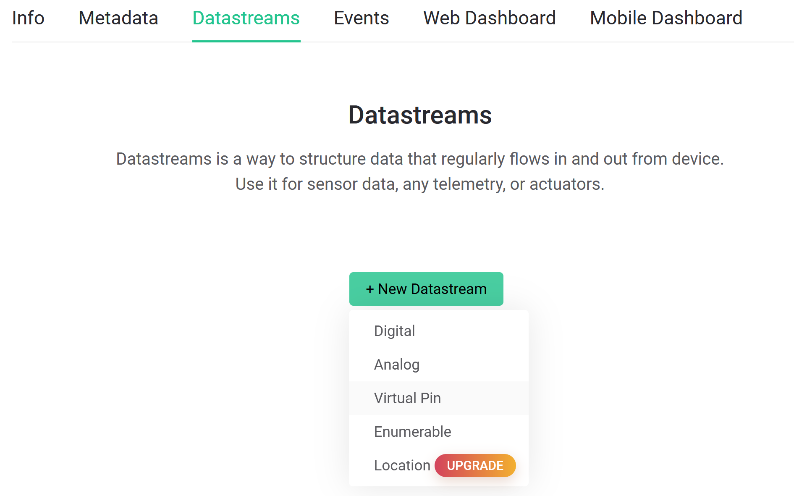
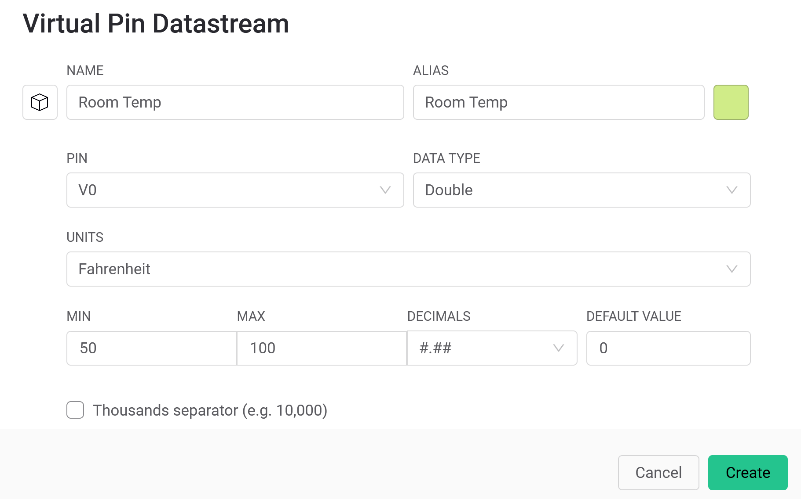
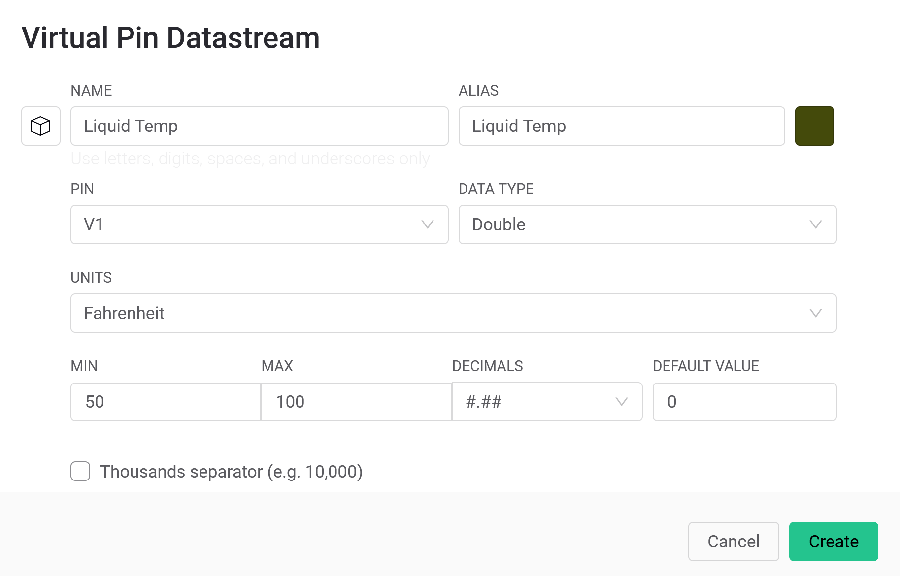
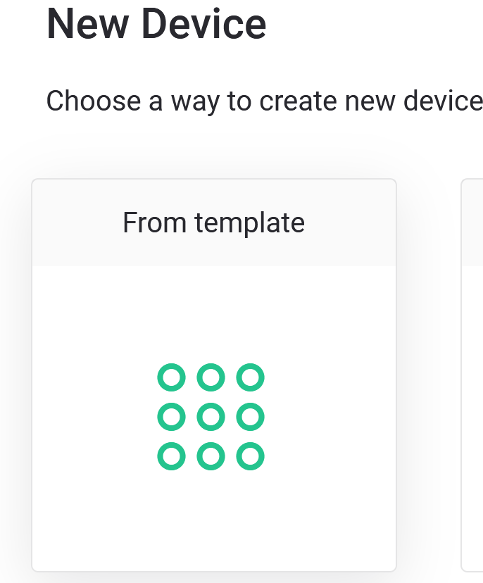
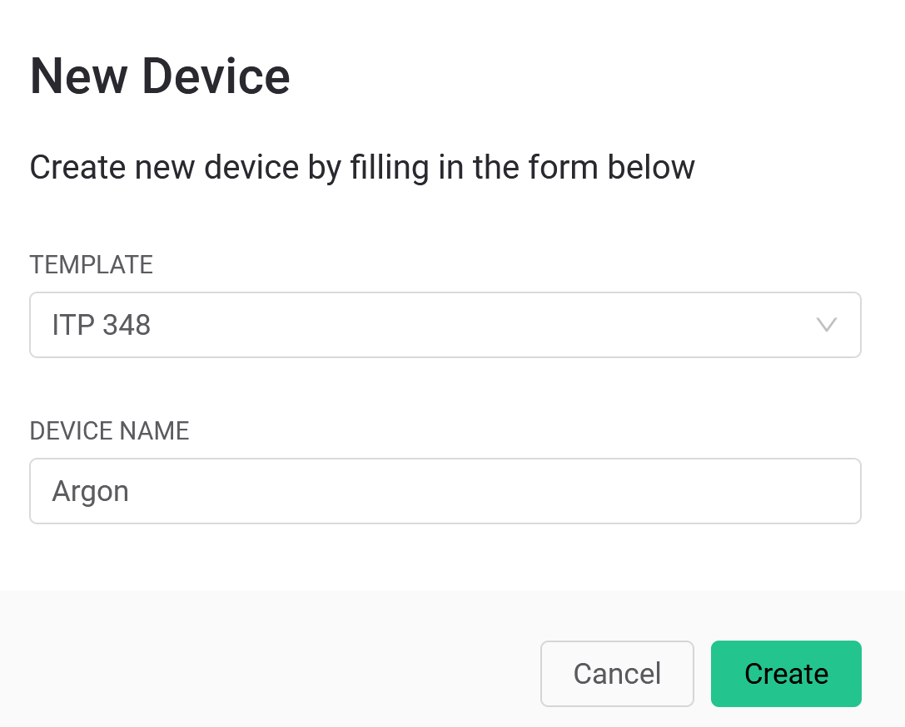

<!-- headingDivider: 2 -->

# Blynk


# New Blynk cloud config

Note to self: need to create a new template for each project; need to create datastream for each variable ahead of time; need to create device for each project	 

### Create template


### Create datastreams








Click **Save**

 

### Create new device






Copy config info

​	

### Create Sketch

Start with this template

```c++
#define BLYNK_TEMPLATE_ID "ADD_YOURS"
#define BLYNK_DEVICE_NAME "ADD_YOURS"

#define BLYNK_PRINT Serial 

#include <blynk.h>

#define BLYNK_IP IPAddress(64, 225, 16, 22)  // https://ny3.blynk.cloud/ – New York
char auth[] = "ADD_YOURS";

void setup() {
    Serial.begin(9600);
    Blynk.begin(auth, BLYNK_IP);
}
void loop() { Blynk.run(); }
```


Change `BLYNK_AUTH_TOKEN` to be a `char[]`

`#define BLYNK_AUTH_TOKEN "z31PRR2NbCeR91OvDzvNTEQzLC_Bezwg";`

to

`char auth[] = "z31PRR2NbCeR91OvDzvNTEQzLC_Bezwg";`


### Test

Device should appear connected 


### Build interface in Blynk mobile app


### Code sketch