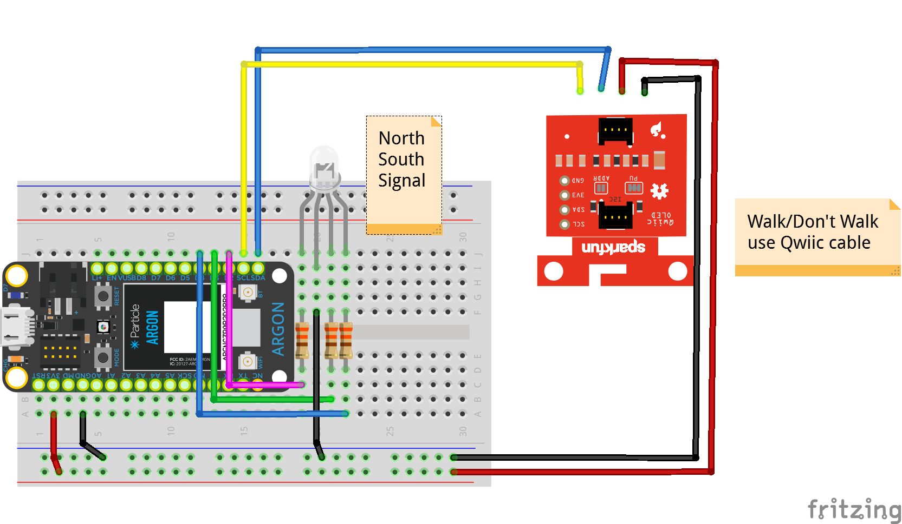

<!-- headingDivider: 2 -->

# State Machines
## In class Lab - Stoplight and Pedestrian Signal

 

## In class Lab - Stoplight and Pedestrian Signal

* We are going to build a stoplight and pedestrian signal for a intersection.
* Car traffic goes North-South.
* Pedstrian traffic goes East-West
* Green lights, red lights, and the walk signal will stay on for 5 sec (`LONG_LIGHT_DURATION`)
* Yellow lights and the don't walk signal will stay on for 2 sec (`SHORT_LIGHT_DURATION`)
* Here is how this type of intersection works

## 

## 

## 

## 

## 

## In class Lab - Stoplight and Pedestrian Signal

* Download starting code
  * Go to [https://bit.ly/ProjectZip](https://bit.ly/ProjectZip)
  * Paste the following link into the top right
  
  `https://github.com/reparke/ITP348-Physical-Computing/tree/master/_exercises/week07/stop_light_rgb_leds_oled_start`

* Wire device as shown below

## Wiring Diagram

## Components
* 1 RGB LEDs
* MicroOLED
* 3 x 330 Ohm resistors

## Wiring Pin Guide

| RGB LED               | Argon Pins |
| ---------------------------- | ---- |
| NorthSouth RGB LED - Red | D2     |
| NorthSouth RGB LED - Green | D3      |
| NorthSouth RGB LED - Blue | D4      |

| MicroOLED (Qwiic cable) | Argon Pins |
| ----------------------- | ---------- |
| GND                     | GND        |
| 3V3                     | 3V3        |
| SDA (Blue)              | SDA        |
| SCL (Yellow)            | SCL        |

## Lab Stages

1. Create cycle with only traffic (North-South) stop lights

2. Add Pedestrian Walk / Don't Walk (East-West) message to OLED 

3. Make Don't Walk light blink when it is on (if time)

   

* We will work through stage 1 together

## General Approach

* We will need to create a way to represent the states using `enum`
* We will need to track state transitions with **variables** for state
* We will need to control timing with `millis()`

* What does `loop()` do
  * calculate new state
  * output traffic signal LEDs based on state
  * independently flash walk signal *(later)*

## Credits

* [Bill Siever](http://siever.info) - [CS132 FSM](http://siever.info/cse132/guides/intro-to-FSMs.html)  (Washington University at St. Louis) 
* [Bill Siever](http://siever.info) - [CS132 Delta Timing](http://siever.info/cse132/weeks/3/)  (Washington University at St. Louis) 
* [USC EE109 State Machines](http://bits.usc.edu/files/ee109/)
* Photo by Laurie Parke
* Photo by [Michael Olsen](https://unsplash.com/@mganeolsen)</a> on [Unsplash](https://unsplash.com/)
* Photo by [Free To Use Sounds](https://unsplash.com/@freetousesoundscom?utm_source=unsplash&utm_medium=referral&utm_content=creditCopyText) on [Unsplash](https://unsplash.com/?utm_source=unsplash&utm_medium=referral&utm_content=creditCopyText)
* Photo by [NON](https://unsplash.com/@non_creation?utm_source=unsplash&utm_medium=referral&utm_content=creditCopyText) on [Unsplash](https://unsplash.com/?utm_source=unsplash&utm_medium=referral&utm_content=creditCopyText)