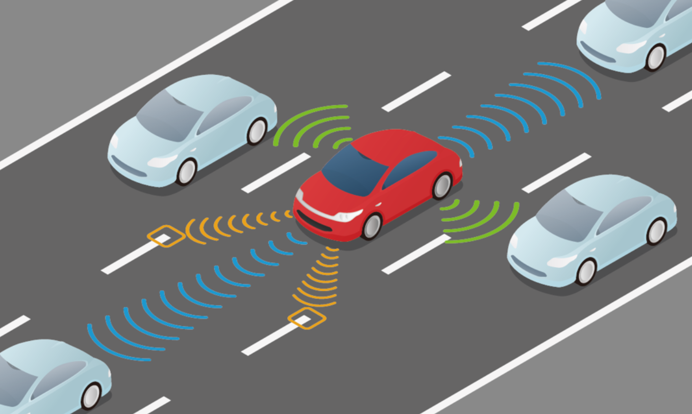
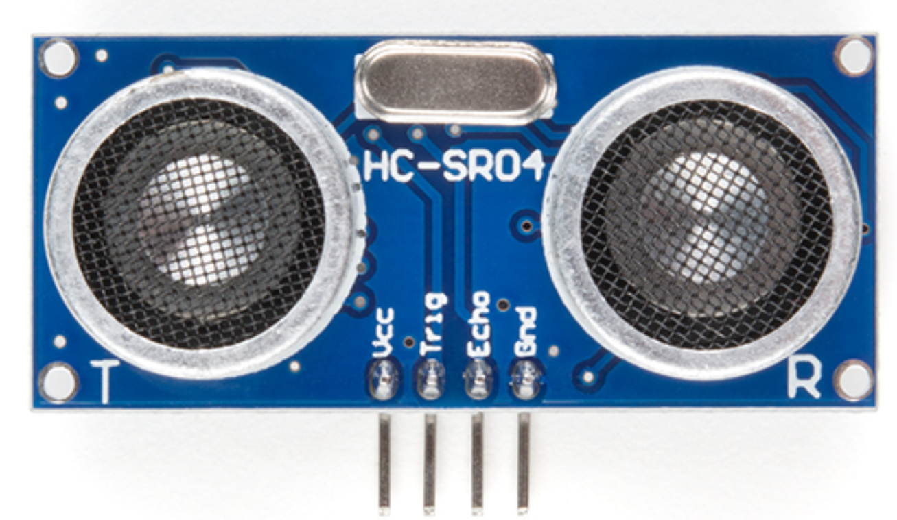
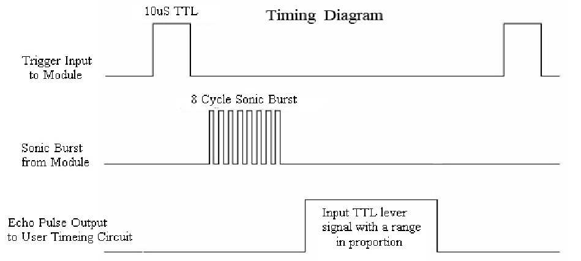
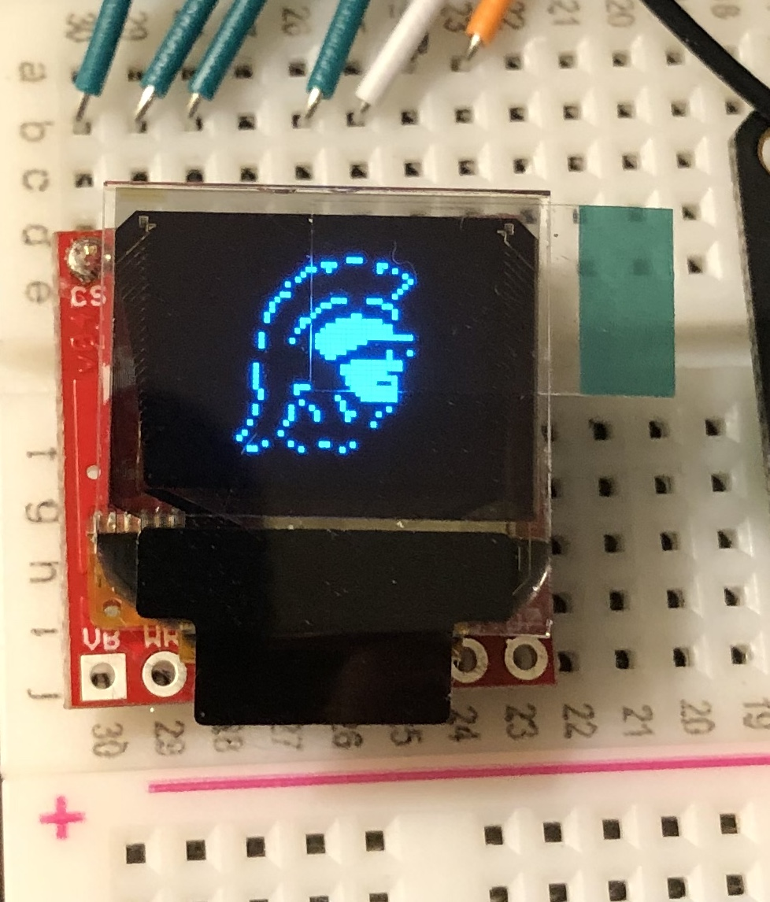
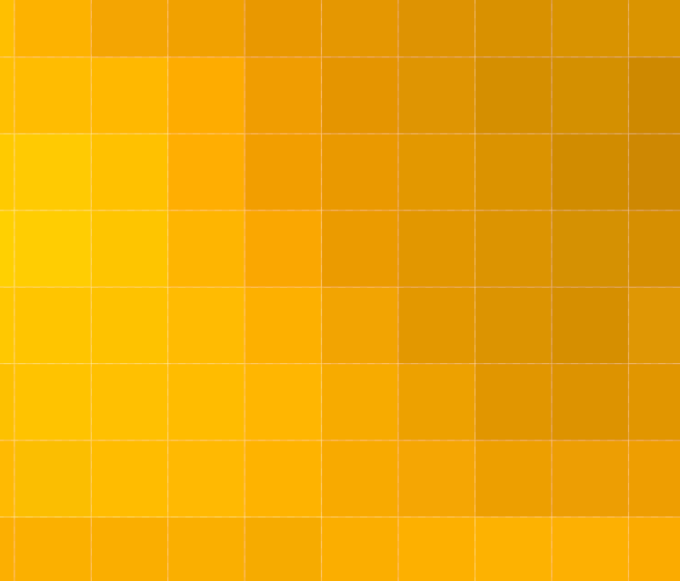
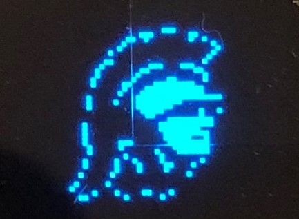
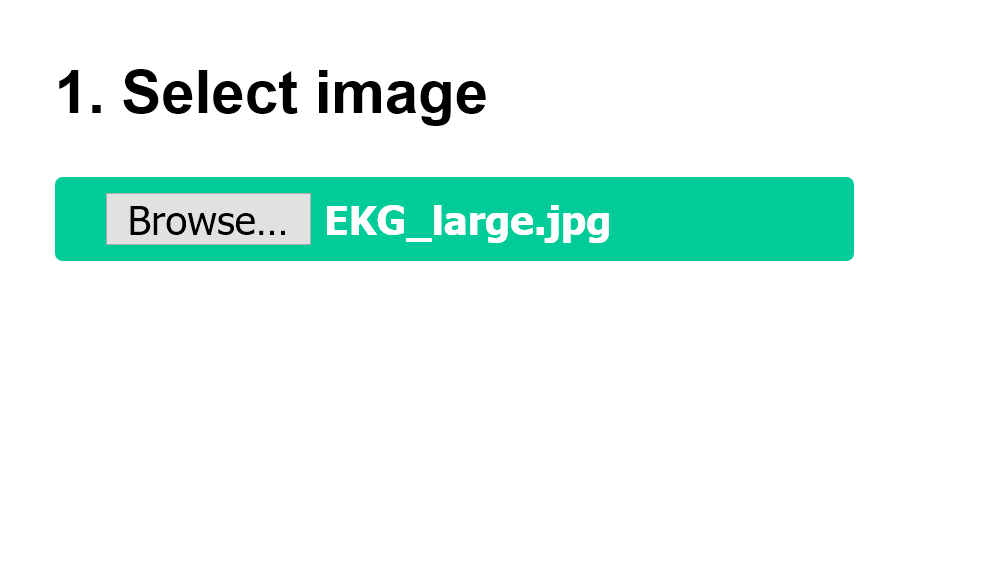
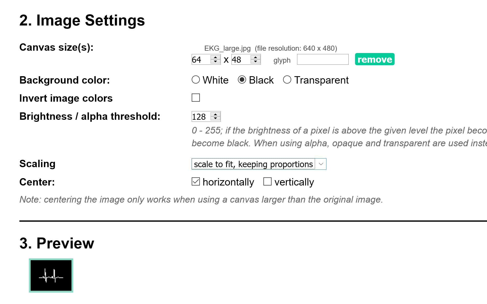
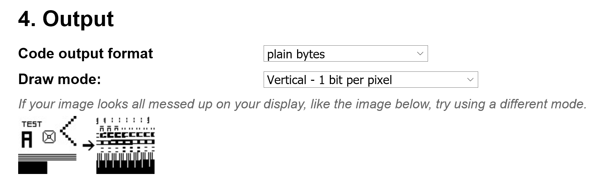
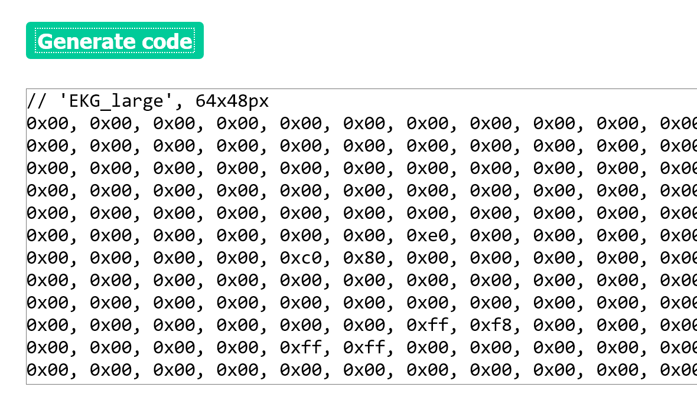

<!-- headingDivider: 2 -->

# Ultrasonic Distance Sensor + OLED Graphics



## Learning Objectives

* Explain how an ultrasonic sensor uses sound and echo time to measure distance
* Use `pulseIn()` and the speed of sound to calculate distance
* Explain how monochrome images are stored as bitmap arrays
* Prepare a bitmap for a 64 x 48 OLED screen
* Describe how sensor data can control text and graphics on a display

# Ultrasonic Distance Sensor



## Ultrasonic Distance Sensor

* Like SONAR!
* Sends 40 KHz sound pulses (higher than human hearing)
* Waits for return sound wave ("echoes" or bounces off nearby objects)
* Distance to object can be calculated

## Uses

* Auto-range finder
* Self-parking cars
* Obstacle avoidance
* Autonomous vehicles
* Fun fact: This is how dolphins and bats navigate

## Parameters

* Operating range
  * Officially: 2 cm - 4 m (1 in - 13 ft)
  * More reliable range: 5 cm - 2 m (2 in - 6.5 ft)
* Angle
  * 15 degrees

<!-- based on some testing online, a more reliable range is 5 cm - 2 m
https://app.box.com/s/sj7du1n32in2777rcoi2
-->

## Sensor Pins

| Sensor | Photon 2   | Function |
| ------ | ---------- | -------- |
| GND    | GND        | Ground |
| VCC    | VUSB       | Power **(requires 5V, but will work with a 3.7V LiPo battery)** |
| TRIG   | Output Pin | Start output pulse sequence |
| ECHO   | Input Pin  | Receive reflection response |

## Timing Diagram



## Timing Part 1: Trigger

* Output sequence
  * LOW for 2 microseconds
  * HIGH for 10 microseconds
  * LOW

```c++
delayMicroseconds(<<DELAY_VAL>>);
```

* Sensor sends out 8 sonic pulses

## Timing Part 2: Echo

* Sensor "listens" for the sound wave to reflect / bounce off an object
* When the reflection is received, the ECHO pin goes **HIGH** for the duration of the reflection and then goes **LOW**
* Use `pulseIn()` to measure how long the input remains HIGH

## Measure Time with `pulseIn()`

* Syntax

```c++
// Measure time in microseconds
// Returns 0 if no signal is received before the timeout
int time = pulseIn(<<PIN>>, <<VALUE>>);
```

* Example

```c++
// Start timing when D2 is HIGH
// Stop timing when D2 is LOW
int time = pulseIn(D2, HIGH);
```

## Calculating Distance

* `pulseIn()` returns the round-trip time for the sound to reach an object and return
* Speed of sound at 20°C (68°F) = 343.5 m / s
* How do we calculate the one-way distance?

## Calculating Distance: Formula

* Speed of sound = 0.03435 cm / microsecond
* Divide by 2 because the measured time includes the trip to the object and back

<p><code>distanceCm = echoTime * 0.03435 / 2;</code></p>

<p><code>distanceIn = distanceCm * 0.393701;</code></p>

## Cautions

* Sound waves can reflect off surfaces in the room and give incorrect readings
* Air conditioning vents and other nearby ultrasonic sensors can cause interference
* There should be a **500 ms** delay between readings

# OLED Screen Graphics



## Screen Parameters

* OLED screen consists of 64 (W) x 48 (H) pixels (3,072 total pixels)
* 3,072 pixels means 3,072 bits (ON or OFF) are needed to display a full image
  * 3,072 bits is 384 bytes (8 bits = 1 byte)
* Each pixel is either ON (HIGH) or OFF (LOW) because there is only one color
* We can display images on the screen in a **bitmap** format

## Pixels

| Original Image | Image Closeup to Show Pixels |
| --- | --- |
|  |  |

## Bitmap

* Bitmaps are stored as large arrays of bytes
* In a monochrome image, there is one bit per pixel
  * 64 pixel x 48 pixel images = 3,072 bits = 384 bytes
* Example:

```c++
const uint8_t heart_bmp[] = {
  0x00, 0x00, 0x00, 0x00,
  0x00, 0x00, 0x00, 0x80,
  0xe0, 0xf0, 0xf8, 0xfc,
  ... };
```

## Creating Bitmaps

* Use a tool to convert an image to a byte array
* Color restrictions
  * Each image should be black and white
  * Color and greyscale can work, but not well
* Image size
  * Use small or actual-size images for better conversion to a bitmap

## Example Images

| Original Black / White Image | Bitmap on OLED |
| --- | --- |
|  |  |

* White is the color that will be displayed on the OLED

## Image Size vs. Canvas Size

* The source image may have different dimensions than the OLED
* The canvas is the complete 64 x 48 pixel area sent to the screen
* The converter scales or positions the source image within that canvas
* Blank areas of the canvas are still represented in the byte array

## Settings

* Note
  * The following settings are specific to the SparkFun Micro OLED
  * The SparkFun library requires each bitmap to be specified as 64 x 48 pixels or 384 bytes (**canvas size**), even if parts of the image are blank
* Image settings
  - Canvas size: 64 x 48
  - Glyph: blank
  - Scaling: Scale fit, keeping proportions
* Output
  - Code output format: Arduino code, single bitmap (later in the source, change the declaration to `const uint8_t <PUT BITMAP NAME HERE>[]`)
  - Draw mode: Vertical - 1 bit per pixel

## Example: Converting an Image with [Image2CPP](https://javl.github.io/image2cpp/)



## Image2CPP Settings



## Image2CPP Preview



## Image2CPP Output



## Storing Byte Array

* Create a `const uint8_t` array (byte array)

```c++
const uint8_t heart_bmp[] = {
  0x00, 0x00, 0x00, 0x00,
  0x00, 0x00, 0x00, 0x80,
  0xe0, 0xf0, 0xf8, 0xfc,
  ... };
```

* Use the library to display the bitmap

## Tools for Converting Images to Bitmaps

* Online: [Image2CPP](https://javl.github.io/image2cpp/)
* Windows: [LCD Assistant](http://en.radzio.dxp.pl/bitmap_converter/)
* Mac: [bitmapToC](https://github.com/hoiberg/bitmapToC)

## Connecting Sensor Input to Display Output

1. Trigger the ultrasonic sensor
2. Measure the echo time and calculate distance
3. Use the distance to make a decision
4. Draw the matching text or bitmap
5. Update the OLED

## Credit

* [SparkFun Ultrasonic Distance Sensor](https://www.sparkfun.com/products/15569)
* [Sensor Datasheet](https://cdn.sparkfun.com/datasheets/Sensors/Proximity/HCSR04.pdf)
