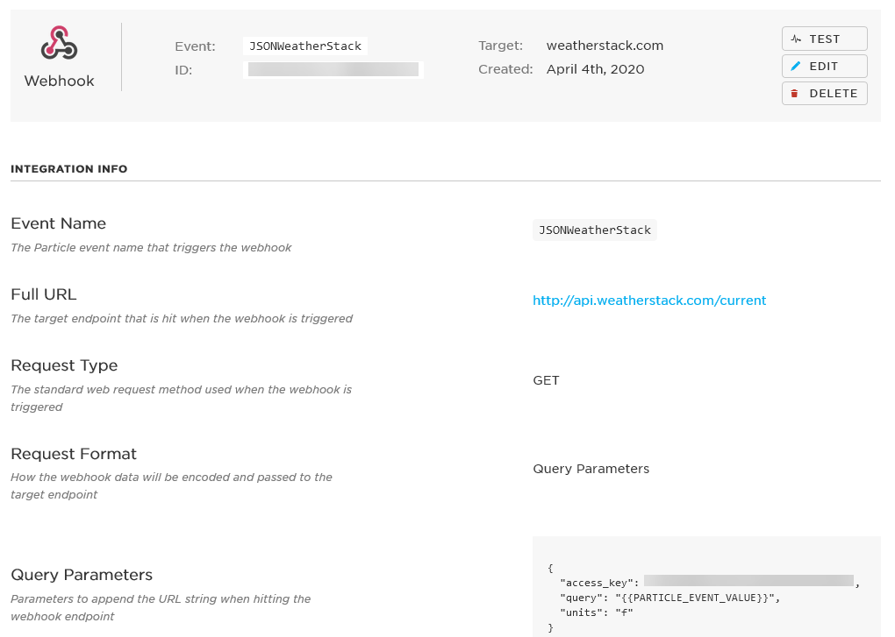
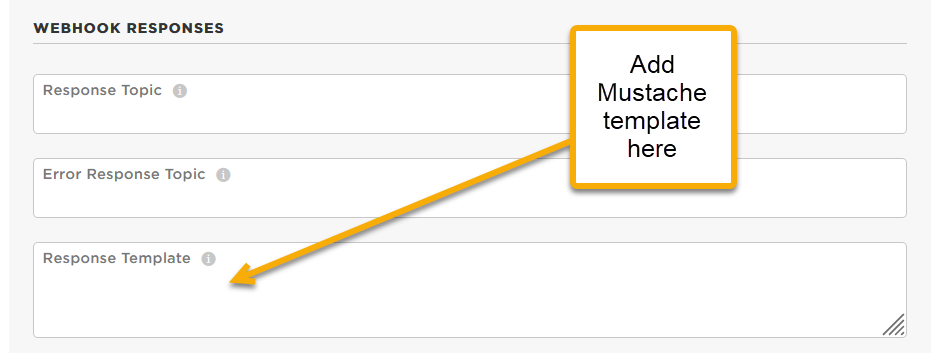

<!-- headingDivider: 2 -->

# Retrieving Data from APIs

## Overview

- APIs provide useful data we can use in our device (e.g. weather and location data)
- Each API will be configured slightly differently but the process to connect is generally similar


## Steps to Connect Photon 2 and API

0. Determine how to use the API
1. Create an integration -> webhook on [Particle console](https://console.particle.io/integrations) 
2. Use `Particle.publish` to trigger webhook
3. Use `Particle.subscribe` to "listen" for response from webhook
4. Create Mustache template that tells the Particle Cloud to which relevant data from the response should be to the Photon 2 (and the rest of the data will be ignored)
5. Create **function handler** that is used by `Particle.subscribe` to process JSON

## Step 0: How to use the API

- Each API is different, but they will usually have documentation that describes how to connect
- Typically, this will include
  - Endpoint (URL you communicate with)
  - Parameters to include in your request (e.g. name of city you want weather data for)
  - How to obtain an API key (if necessary)

## Step 0: How to Use the API

Example: WeatherStack


## Step 1: Create Webhook In Particle Console

**Particle integration settings**



## Part 2: Publish Event to Trigger Webhook

**Photon 2 firmware**

```c++
void loop() {
  String data = "90089";	//USC zip code
  
   // Trigger the integration
  Particle.publish("JSONWeatherStack", data, PRIVATE);
 
   // Wait 60 seconds
  delay(60000);
}

```

## Part 3: Subscribe to JSON response from Weather Stack

**Photon 2 firmware**

```c++
void setup() {
  // Subscribe to the integration response event
  Particle.subscribe("hook-response/JSONWeatherStack",
                      jsonSubscriptionHandler, MY_DEVICES);
}
```

## Part 4 : Create Mustache template


## Part 4 : Create Mustache template

- Often we might only want a few items from the JSON, but the webserver sends the entire message
- This extra data can waste time, bandwidth, power, and the response size can create errors
- Instead, we can have Particle webserver send us only the data we actually want by creating **Mustache templates**

<!-- Inserting a variable with double braces {{a}} will do HTML escaping of the characters &<>"'. To avoid this, use triple braces {{{a}}} -->

## Example: Entire Weather Stack JSON Response


## Example: What if we only want the temperature?


### Creating Mustache Webhook Response Templates

**Particle Console Webhook**



## Example: Mustache Format


- If we are only interested in the `temperature` value which is nested in the `current` object, we could create a template like the following

```json
  {"temp":"{{{current.temperature}}}"}
```

- Now instead of the server sending entire JSON response, it will only send the following
```json
  {"temp":"61"}
```

- For webhook response templates, make sure the template will always result in valid JSON (i.e. `{"name":"value"}`)

## Part 5: Creating the function handler to receive and parse the JSON

* The last step is to create Photon 2 code to handle / parse the JSON response
* While it is possible to manually parse JSON in C++, it is considered unsafe due to potential for security vulnerabilities
* **Instead, use a library**
* [Instruction and examples for parsing JSON with `ArduinoJson`](lecture_json_parsing_with_arduinojson)


<!--Since JSON is `String` data, it is possible to parse it using C-language techniques like `strtok`, `strcpy`, `atoi` 
However Buffer overrun if the response from the webserver was larger than expected or malformed-->


## Resources

* [Mustache Tester](https://rickkas7.github.io/mustache/)
* [Mustache Variable Reference](https://docs.particle.io/firmware/best-practices/json/#mustache-variables)
* [JSON Validator and formatter](https://jsonformatter.org/) 
* [Weatherstack documentation](https://weatherstack.com/documentation)

## Credits

* Photo by [Inset Agency](https://unsplash.com/@inset_agency?utm_source=unsplash&utm_medium=referral&utm_content=creditCopyText) on [Unsplash](https://unsplash.com/s/photos/rain-umbrella?utm_source=unsplash&utm_medium=referral&utm_content=creditCopyText)


<!--Alternate weather integration service
http://303.itpwebdev.com/~molld/assignment6/list.html
http://303.itpwebdev.com/~molld/assignment6/main.js
 -->