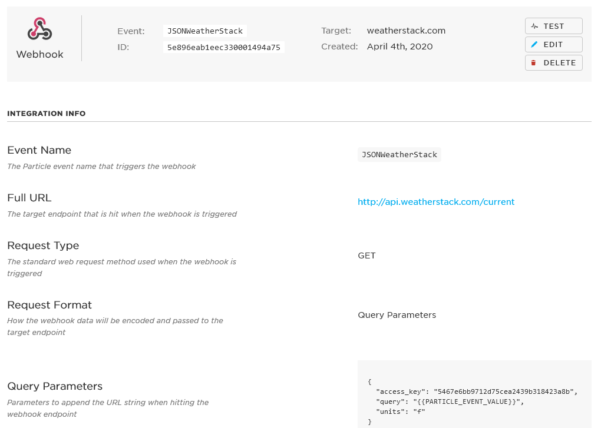

Alternate weather integration service

* This is the final project:

* http://303.itpwebdev.com/~molld/assignment6/list.html

* This is the script that is specifically used in the assignment utilizing the API:

* http://303.itpwebdev.com/~molld/assignment6/main.js

* Let me know if you have trouble accessing anything or want more information!
* 


Links

* Overiew and tutorial https://github.com/rickkas7/JsonParserGeneratorRK
* Mustache creation tool (helps with crafting response template) http://rickkas7.github.io/mustache/
* JSON Validator and formatter https://jsonformatter.org/
* Weatherstack documentation https://weatherstack.com/documentation
* 


Parsing webhook response values with strtok

* (from sanjay) for reference, strcpy, strtok, and atoi are all consider very unsafe to use because the potential for security vulnerabilities is extremely high because you can easily buffer overrun if the response from the webserver was bigger than 512 or malformed
* use JSON library instead



```json
{
  "request": {
    "type": "Zipcode",
    "query": "92831",
    "language": "en",
    "unit": "f"
  },
  "location": {
    "name": "Fullerton",
    "country": "USA",
    "region": "California",
    "lat": "33.887",
    "lon": "-117.895",
    "timezone_id": "America/Los_Angeles",
    "localtime": "2020-04-04 21:30",
    "localtime_epoch": 1586035800,
    "utc_offset": "-7.0"
  },
  "current": {
    "observation_time": "04:30 AM",
    "temperature": 61,
    "weather_code": 122,
    "weather_icons": [
      "https://assets.weatherstack.com/images/wsymbols01_png_64/wsymbol_0004_black_low_cloud.png"
    ],
    "weather_descriptions": [
      "Overcast"
    ],
    "wind_speed": 6,
    "wind_degree": 170,
    "wind_dir": "S",
    "pressure": 1012,
    "precip": 0,
    "humidity": 67,
    "cloudcover": 100,
    "feelslike": 61,
    "uv_index": 1,
    "visibility": 10,
    "is_day": "no"
  }
}
```


```c++
#include "JsonParserGeneratorRK.h"
JsonParser jsonParser;  // dynamic version: needs to be global if multi-part
                        // responses will be sent

String response;
double temp;
double humidity;  // both doubles
int precipation;
String description;
String city;

void setup() {
  // Subscribe to the integration response event
  Particle.subscribe("hook-response/JSONWeatherStack", jsonSubscriptionHandler,
                     MY_DEVICES);
}

void loop() {
  // Get some data
  String data = "92807";
  // Trigger the integration
  Particle.publish("JSONWeatherStack", data, PRIVATE);
  // Wait 60 seconds
  delay(60000);
}

void jsonSubscriptionHandler(const char *event, const char *data) {
  int responseIndex = 0;

  const char *slashOffset = strrchr(event, '/');
  if (slashOffset) {
    responseIndex = atoi(slashOffset + 1);
  }

  if (responseIndex == 0) {
    jsonParser.clear();
  }
  jsonParser.addString(data);
  Serial.println("Event:\n" + String(event) +
                 " parse(): " + String(jsonParser.parse()));
  //   Serial.println("Data:\n" + String(data));

  if (jsonParser.parse()) {
    // Looks valid (we received all parts)


    city = jsonParser.getReference().key("location").key("name").valueString();
    temp = jsonParser.getReference()
               .key("current")
               .key("temperature")
               .valueDouble();
    humidity = jsonParser.getReference()
                   .key("current")
                   .key("humidity")
                   .valueDouble();

    description = jsonParser.getReference()
                      .key("current")
                      .key("weather_descriptions")
					  .index(0)
                      .valueString();

    precipation =
        jsonParser.getReference().key("current").key("precip").valueInt();

    Serial.println(city + "\n  " + description + "\n  temperature: " +
                   String(temp, 1) + " F\n  humidity: " + String(humidity, 1) +
                   "%\n  rainfall: " + String(precipation) + " in");
  }
}
```

