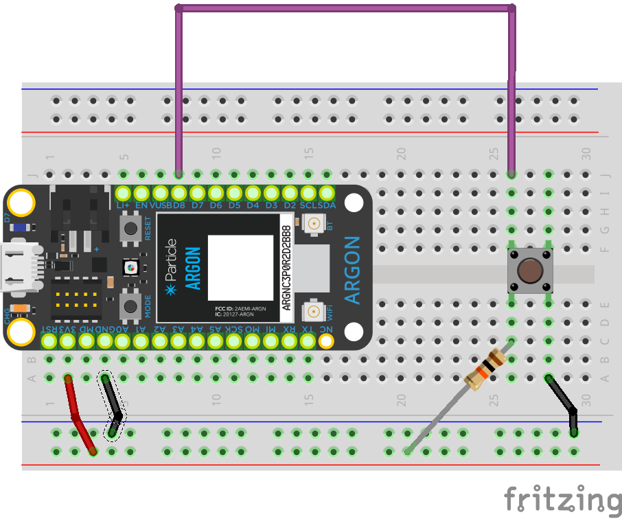

<!-- headingDivider: 2 -->

# Sleep and Wake Up

## Power Conservation

- Continuously keeping the Argon uses a lot of power

  - Connection to Particle Cloud

  - Running `loop ()`

  - Responding to any interrupts or inputs
- To limit wasting electricity and extend the time between battery charges, you can put the device to **sleep**, which turns off some or all of the Argon components
- Note: Use sleep when device will be powered down for more than 10 seconds. Less than that and you will use more power turning it on / off than you will save

## Zzzz....Three Sleep Modes

- `STOP` (most wake options, highest power)
- `ULTRA_LOW_POWER` (ULP)
- `HIBERNATE` (fewest wake options, lowest power)

## Sleep Considerations

- Choosing the specific sleep mode and options depends on your specific application

- Some things you'll need to consider
  - How do you want to wake up the device?
  - How long in between wake periods will you have?
  - How quickly do you need the device to respond once it wakes?
- In general, choose the mode that uses the least power but support the features you want

## Power vs. Responsiveness


<!-- This shows that you can conserve power if you hibernate but it will take longer to publish a message -->


## Options to Wake Argon

| `ULTRA_LOW_POWER`       | `HIBERNATE`      |
| ----------------------- | ---------------- |
| signal on input pins    | signal on inputs |
| time duration           | time duration    |
| specific analog voltage |                  |
| Serial input            |                  |
| Bluetooth               |                  |
| Wifi signal             |                  |

## What Happens After Waking


<!-- note HIBERNATE wakes as if it has been reset. It goes through setup() again and starts with all non-retained variables cleared. In ULTRA_LOW_POWER and STOP modes, execution continues after the line of code that put the device to sleep, with all variables preserved. -->

## Sleep Syntax

- Here is the general syntax to sleep 

```c++
SystemSleepConfiguration config;
config.mode(SystemSleepMode::<<ADD SLEEP MODE>>).<<ADD WAKE OPTIONS>>;
System.sleep(config);
```

- Example: Put device in `HIBERNATE` and wake after 10 min

```c++
SystemSleepConfiguration config;
config.mode(SystemSleepMode::HIBERNATE).duration(10min);
System.sleep(config);
```
- Example: Put device in `ULTRA_LOW_POWER` and wake with a falling (`HIGH` to `LOW`) signal on pin D8

```c++
SystemSleepConfiguration config;
config.mode(SystemSleepMode::ULTRA_LOW_POWER).gpio(D8, FALLING);
System.sleep(config);
```
- Example: Put device in `ULTRA_LOW_POWER`, and wake with a rising (`LOW` to `HIGH`) signal on pin D5 **or** after 2 hours

```c++
SystemSleepConfiguration config;
config.mode(SystemSleepMode::ULTRA_LOW_POWER).gpio(D5, RISING).duration(2h);
System.sleep(config);
```

## Waking but Staying Silent

- Using the wifi and connecting to the cloud takes time and uses battery

- If you are collecting data that doesn't need to be updated in real-time, you can do the following

  - Sleep the Argon

  - Wake up after a fixed time, but do **not** connect to the cloud

  - Read sensor data

  - Sleep the Argon

  - After a certain amount of time or number of sensor readings, you can send all the saved data to the cloud at once


## Controlling Cloud Connection

- To prevent automatic connection to the cloud, use the following command at the top of your code (**not** inside `loop` or `setup`)

```c++
SYSTEM_MODE(SEMI_AUTOMATIC);
```

- When you are ready to connect to the cloud, run the following command in your code

```c++
Particle.connect();
```

  

## Lab



## Credit

* [Particle - About Sleep](https://docs.particle.io/tutorials/learn-more/about-sleep/)
* [Particle - `sleep()` documentation](https://docs.particle.io/cards/firmware/sleep-sleep/sleep-sleep/)


