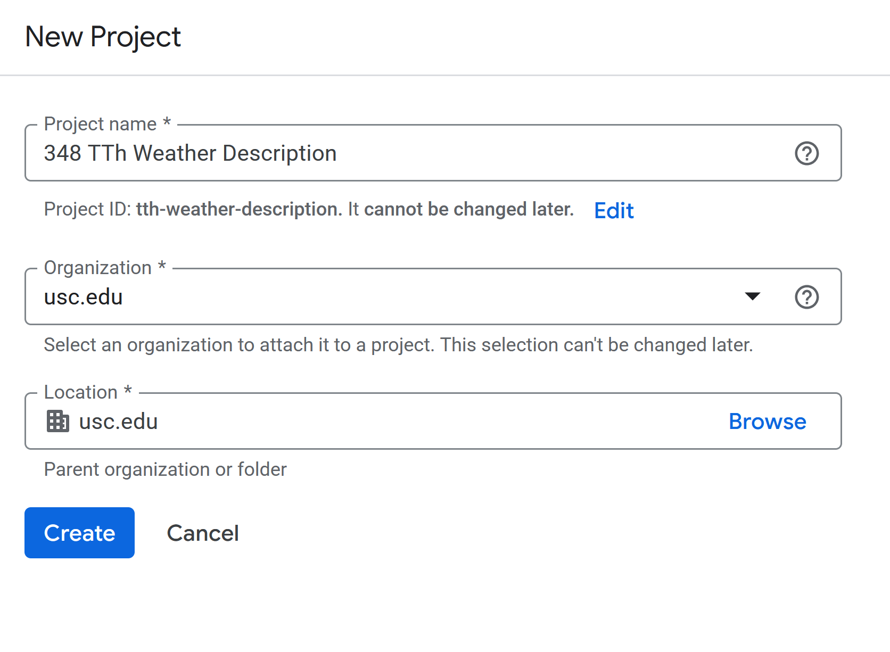
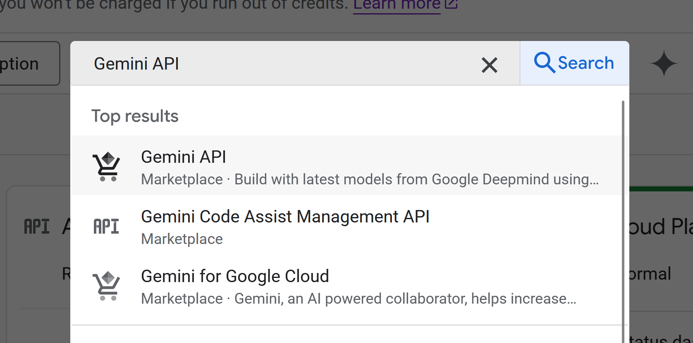
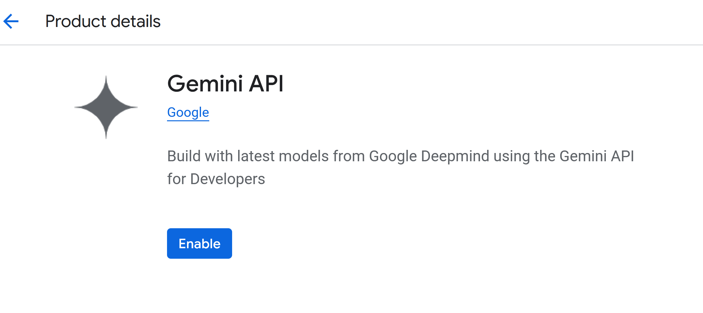
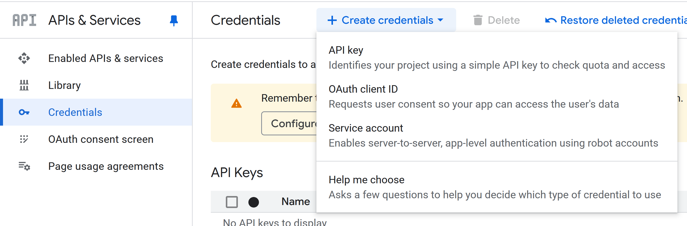
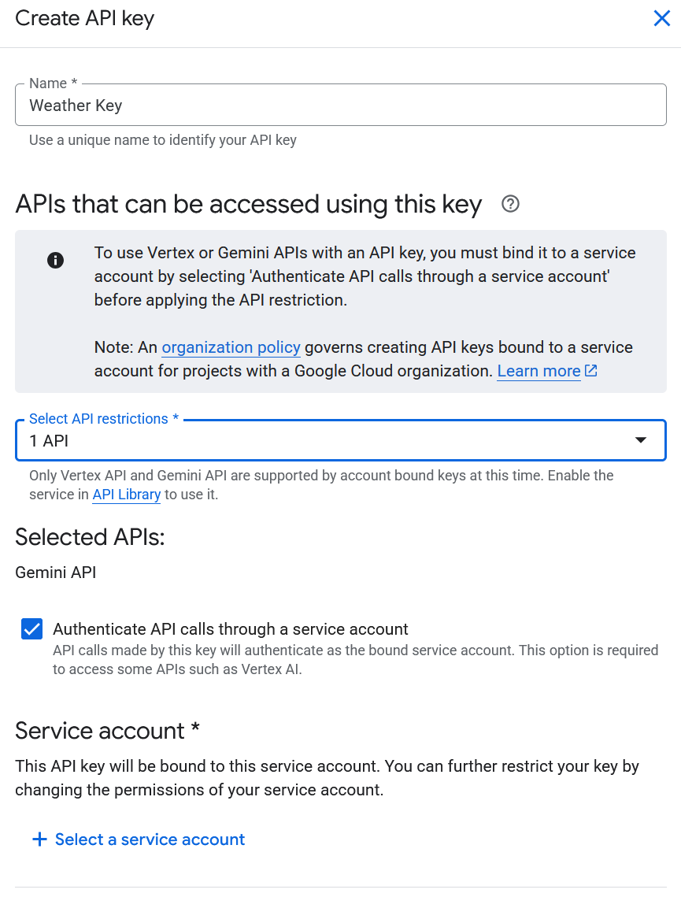
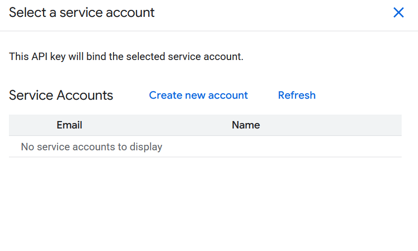
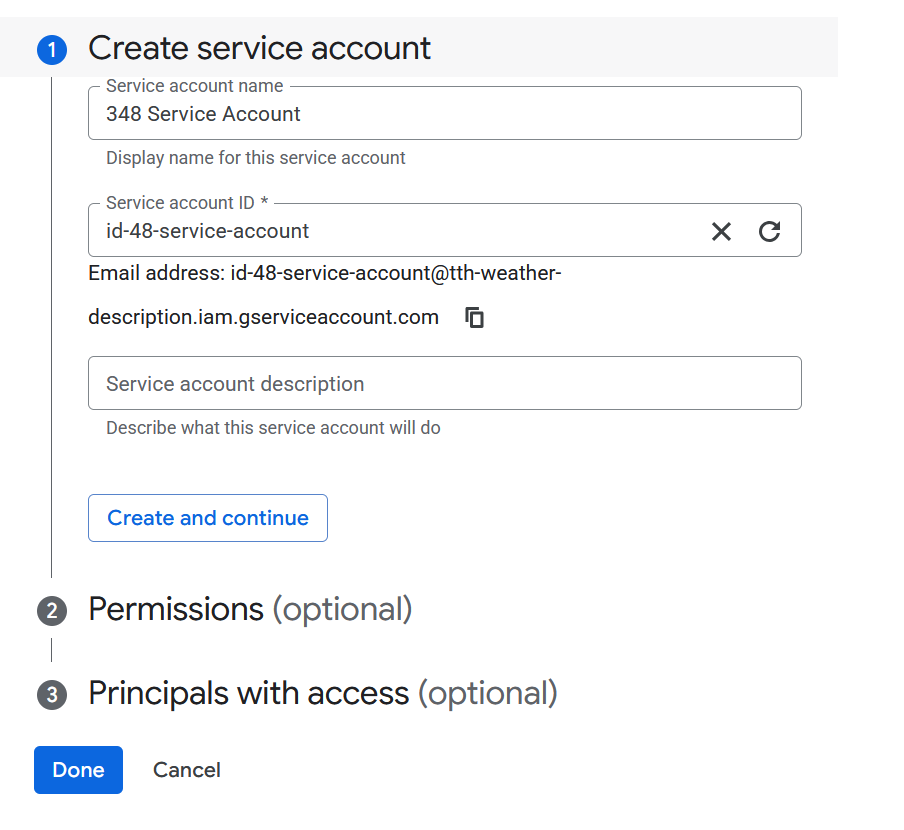
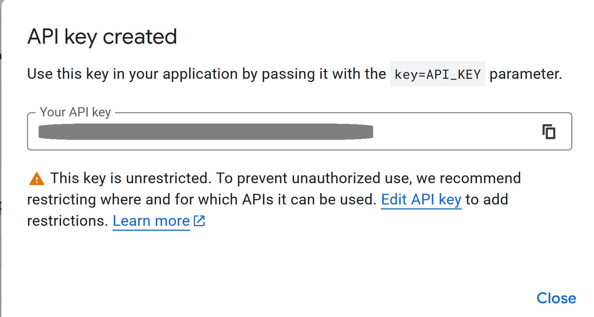

## Create Google Cloud Project

* Visit [Google Cloud Console](https://console.cloud.google.com/)
* Create new project



## Activate Generate Language API / Gemini API

* In the search box, type **Gemini API** and select the name in the dropdown



* Click **Enable**



## Create API key for Generate Language API / Gemini

* On the left, click **Credentials** and then click **+ Create credentials**



## 



## 



## 



* Copy API key



* Click **Edit API key**
* On the next page, do the following
  * Give the key a meaningful name
  * Under **API restrictions** click **Restrict key**
  * Click the dropdown box and type **Generate Language API**
* It may take 5-10 for key to be active


# Gemini API Webhooks

## The API JSON Structure


- Sending prompts via a webhook requires a specific JSON format
- The structure follows a nested hierarchy that the Google Cloud Console expects
- In Particle, we use placeholders like `{{temp}}` to inject real sensor data into the prompt

## JSON Anatomy: Contents and Parts

- **`contents`**: An array that represents the conversation history
- **`parts`**: A nested array within contents that holds the actual message data
- **`text`**: The string where you define the persona, provide the data, and give the instruction
- This nesting allows the API to distinguish between different types of media or multiple turns in a chat

## Finding Documentation

- The primary source for these structures is the **Google AI for Developers API Reference**
- Look for the **`generateContent`** method under the REST API section
- The documentation defines the "Request Body," which lists every field you can include in your JSON

## Customizing Behavior: generationConfig

- You can add a `generationConfig` block to control the "vibe" of the output
- **`temperature`**: Controls randomness (0.1 for facts, 0.9 for wit)
- **`maxOutputTokens`**: Limits the response length to save memory or screen space
- **`responseMimeType`**: Can be set to `application/json` if you want the AI to return data your code can parse

## Webhook Implementation Code

JSON

```
{
  "contents": [
    {
      "parts": [
        {
          "text": "You are a concise assistant. Sensor data: {{data}}. Task: Summarize."
        }
      ]
    }
  ],
  "generationConfig": {
    "temperature": 0.7,
    "maxOutputTokens": 100
  }
}
```

## Prompt Engineering for IoT

- Be explicit about the format you want (e.g., "provide a single, short phrase")
- Tell the model what to exclude to keep the string clean for small displays
- Use the system instruction field if you want the persona to be permanent across different prompts
- Always test your JSON in a validator like JSONLint before deploying to the Particle console


## Create Particle Webhook

* Go to [Particle console](https://console.particle.io/)
* Go to Cloud Services > Integration > Create custom webhook
* Use the following settings
  * **Name**: a meaningful description (for you) 
  * **Event name**: the specific event you want to publish to in your code
  * **URL**: `https://generativelanguage.googleapis.com/v1beta/models/gemini-2.5-flash:generateContent`
  * Request type: `POST`
  * Request body: `JSON`
* Go to **Extra Settings**, and under **JSON Body** add

```json
{
  "contents": [
    {
      "parts": [
        {
          "text": "You are a concise, witty weather assistant. Based on a weather code of {{code}}, a humidity percentage of {{humidity}}, and a temperature of {{temp}} degrees Fahrenheit, provide a single, short, descriptive phrase (max 10 words). Do not include the code or temperature in your final phrase. For example, 'A beautiful 76 degrees for a Sunday stroll.'"
        }
      ]
    }
  ]
}   ]
    }
  ]
}
```

* Under **Query Parameters**, add
  * **Key: ** `key`
  * **Value:** `YOUR_API_KEY_FROM_GOOGLE_CLOUD_CONSOLE"


* Send JSON

```json
{"temp":49.900002, "code":0, "humidity":84}
```


* Sample response

```json
Clear, cool, and surprisingly sticky.
```


* Notes
  * There seem to be quota issues about too many messages per second