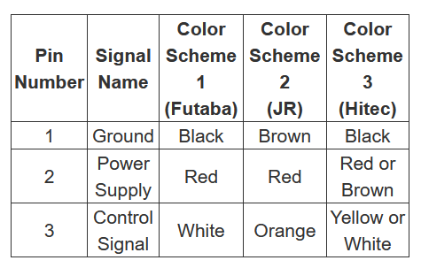
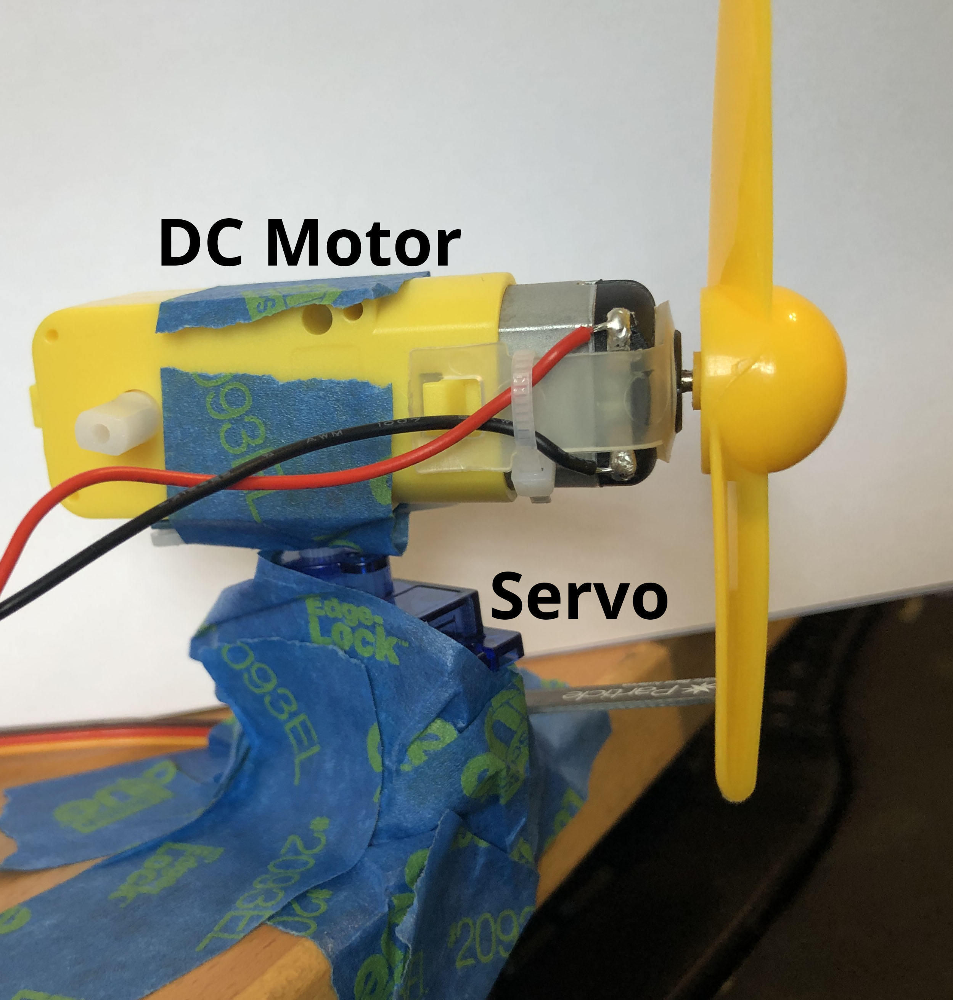
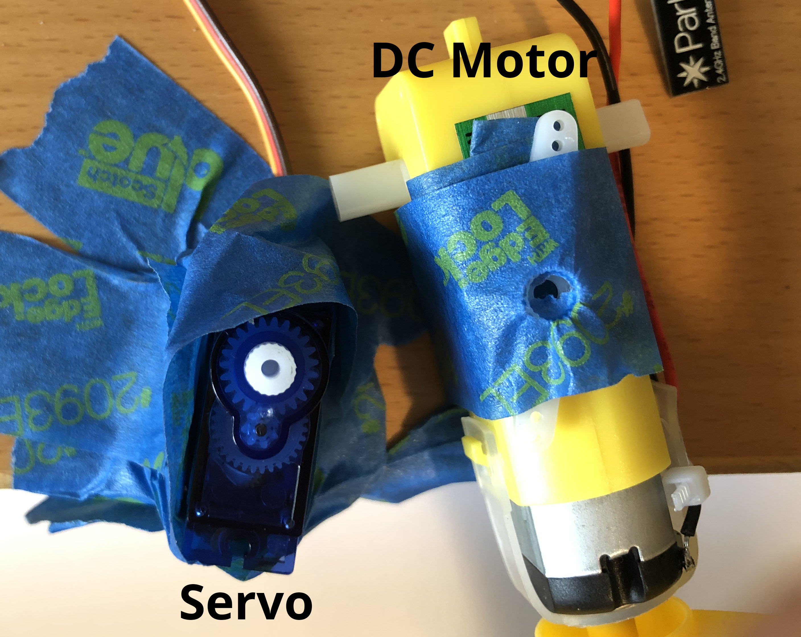
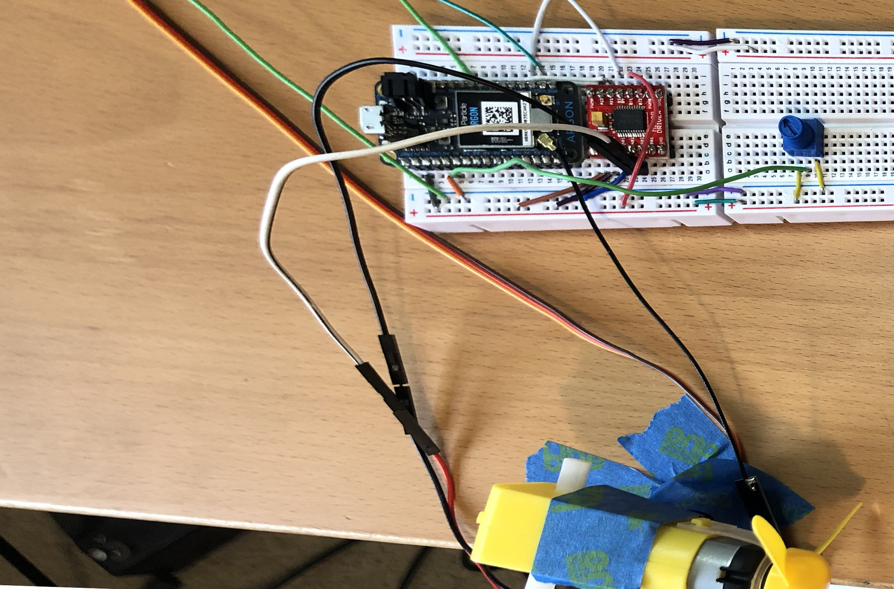

## Week {{page.week}}

### Watch before class this week

* Bluetooth

  

* Lithium Ion Batteries
  

### Read before class this week

* [Motors Reference Notes](https://www.electronicproducts.com/Electromechanical_Components/Motors_and_Controllers/Motor_control_design_an_introduction_to_motors_and_controllers.aspx)

### Bring to class all this week

- Photon 2, breadboard, resistors, push buttons, LEDs, RGB LEDS, wires, potentiometer
- DC motor with fan blade and motor driver
- Servo motor
- Lithium ion battery
- *You can see what parts look like visually by checking out the [kit page](https://reparke.github.io/TAC348-Making-Smart-Devices/kit)*

### Install before class all week 

- Install the [Adafruit Bluefruit](https://learn.adafruit.com/bluefruit-le-connect) app on your phone

### Build before class Mon / Tue

The goal is to build a rotating fan. Here is the circuit wiring, and photos are below 

#### Wiring for Motor Controller

| Motor Controller | Photon 2 | DC Motor            |
| ---------------- | -------- | ------------------- |
| PWMA             | A5       | -                   |
| AI2              | D4       | -                   |
| AI1              | D3       | -                   |
| AO1              | -        | Motor wire (either) |
| AO2              | -        | Motor wire (either) |
| VCC              | 3v3      | -                   |
| GND              | GND      | -                   |
| VM               | 3v3      | -                   |
| STBY             | 3v3      | -                   |

#### Wiring for Potentiometer

- 3.3v
- `A0`
- GND

#### Wiring for Servo

* The wiring colors vary with different servos so look carefully at your documentation
* Many servos will require **5V** not **3.3V** so use `VUSB` 

#### Photos

### Optional: Bluetooth Reference

* [Bluetooth Basics](https://learn.sparkfun.com/tutorials/bluetooth-basics/all)
* [Introduction to Bluetooth Low Energy](https://learn.adafruit.com/introduction-to-bluetooth-low-energy/)
