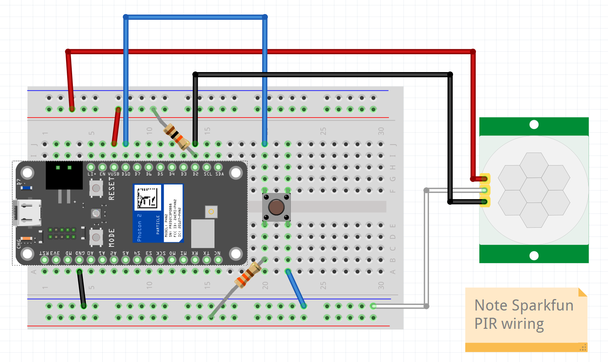

## Week {{page.week}}

### Watch before class this week

* PIR Sensor
  
* Sleep and Battery Conservation
  

### Bring to class all this week

- Photon 2, breadboard, resistors, push buttons, LEDs, RGB LEDS, wires potentiometer
- PIR sensor

### Build before class Mon / Tues 

