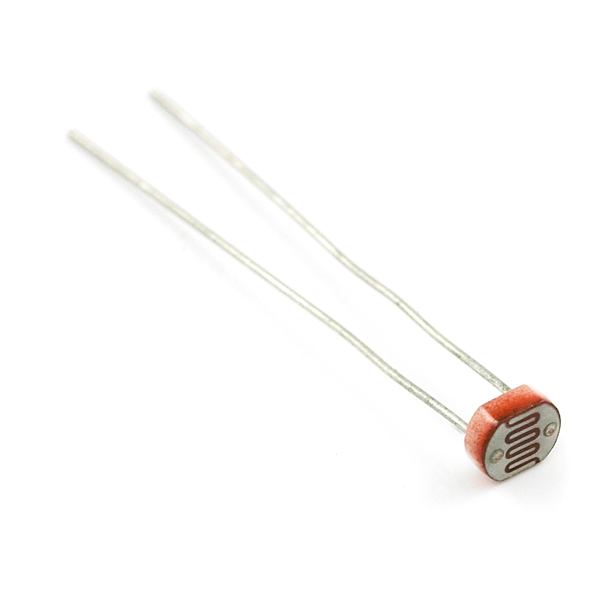

<!-- headingDivider: 2 -->

# Photoresistors




## Wiring

- Requires analog input pin
  - `A0`
  - `A1`
  - `A2`
  - `A5`
  - `A3` (`SDA` or `D0`)
  - `A4` (`SCL` or `D1`)


## Operation

* As light level varies, Photon 2 will measure a voltage change on analog input (due to voltage divider)
* Since this is an analog input, we use **analog to digital conversion** to read input
* Voltage on pin will varies 0v to 3.v, and Photon 2 will read 0 to 4095 

## Code

```c++
const int PIN_PHOTORESISTOR = A1;

void setup() {
    Serial.begin(9600);
    pinMode(PIN_PHOTORESISTOR, INPUT);
}

void loop() {
	// read analog value (ADC); range 0-4095
    int lightReading = analogRead(PIN_PHOTORESISTOR);

	// if you want to know the actual voltage 
	int voltage = (float) lightReading / 4095 * 3.3;
}

```


## Credit

- [Sparkfun](https://www.sparkfun.com/products/9088)
- [Sparkfun](https://www.sparkfun.com/products/9806)
- Images created with [Fritzing](https://fritzing.org/home/)
